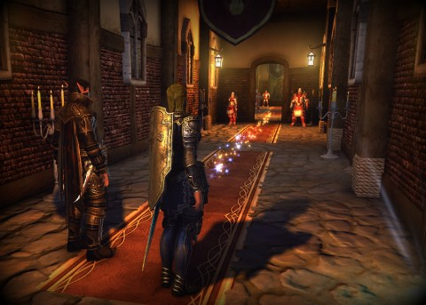
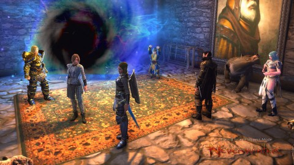
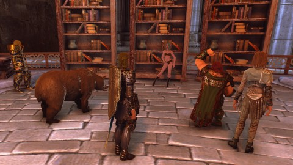
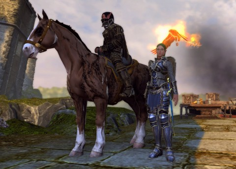

Back to: [West Karana](/posts/westkarana.md) > [2013](/posts/2013/westkarana.md) > [July](./westkarana.md)
# Neverwinter: Return to Azeroth(ia)

*Posted by Tipa on 2013-07-02 06:35:19*

[caption id="attachment\_10938" align="aligncenter" width="480"] The Scarlet Library?[/caption]

Each week, when Kasul and I meet for Neverwinter, we never know quite what we're going to be doing. Grinding quests to max level? Not really our thing. We've got our whole crafting operation to worry about, the endless skirmishes, the occasional dungeon -- our only problem, really, is having enough time to do it all.

Our free companions had reached their max level -- 15 -- and were not up to their jobs any more. Which was really unfortunate, because my companion was a cleric, and healing is a nice thing to have. Kasul was rocking a control wizard companion. Both needed replacing. Kasul got Dogsupial, a skeletal dog dropped from the recent demonic invasion of the city of Neverwinter. I spent my astral diamonds on Flambert, an apprentice phoenix obtained from Nightmare/Nachtmahr lockbox. We spent an off-night last week leveling up the new companions so they'd be ready for our regular adventures.

It was Kasul's night to choose the Foundry's we'd be doing. We traveled to the instance and ---

[caption id="attachment\_10939" align="aligncenter" width="480"] How does my shield float like that?[/caption]

--- stepped into World of Warcraft. A portal had apparently been opened that connected Faerûn to Azeroth. An adventuring party was forming from Azerothians to close it from their end, but their party was comprised solely of naked mailbox-dancing night elves, gold selling druids, hyperactive gnome mages, bubble-hearthing paladins and paranoid dwarf hunters. In short, they were doomed. Though the Azerothian Scarlet Rogue was reluctant to make her presence known to us natives of the Forgotten Realms, it was one of our own that had invaded Azeroth; we would be needed to quell the threat.

We stepped through the portal into Azeroth and found ourselves back in the Scarlet Monastery, the Library instance. I ran this so often back in the day to get that priest staff at the end; the nostalgia was palpable. I almost expected Houndmaster Loksey to drop a key (or at least a dog whistle), but he dropped neither. Arcanist Doan didn't drop either his robe or his staff!

[caption id="attachment\_10940" align="aligncenter" width="480"] Where's the mailbox?[/caption]

When we finished. we found that the WoW party had followed along in our wake, ninja-looting the corpses. They'd have helped on the last boss, but were distracted by the naked night elf.

At our level, Neverwinter requires two Foundry missions to get the daily reward. I couldn't wait to see what Kasul would pick for our second. Turned out there was a sequel to the Scarlet Library -- the Scarlet Cathedral, the renowned instance of Severe, Sudden Overpulling.

The instance's author, though, weren't as cruel as WoW's designers, and we easily cleared the cathedral grounds and headed in to see the WoW party's corpses littering the floor. They'd gone in without us. We soon took care of the invasion force and came face to staring grim visage of the necromancer who'd come to Azeroth from the Forgotten Realms. She just refused to die, but our swords were light in our hands and she eventually succumbed.

The dungeons are **Scarlet Library** and **The Return to Azerothia** by @cojoru179. Highly recommended.

[caption id="attachment\_10941" align="aligncenter" width="480"] Kasul and Nina and Flambert[/caption]

The adventure didn't stop there; we did the Helm's Hold skirmish a couple of times -- I won that blue-tinged sword from it, and finally managed to (barely) complete the Mad Dragon dungeon. We were doing great until the end, but the green dragon Chartilifax got me with her acid breath weapon when my guard was down, and I was pushed by her breath out of range of the cleric and died. Then the wizard died, then both rogues, and it was just the great weapon fighter left, a half orc of decently high level who managed to solo the dragon the rest of the way down while we looked on from the locked door of the lair.

So, that was pretty awesome. I doubt we'll do that dungeon again, though. We could be dying in the Gray Wolf dungeon instead!

