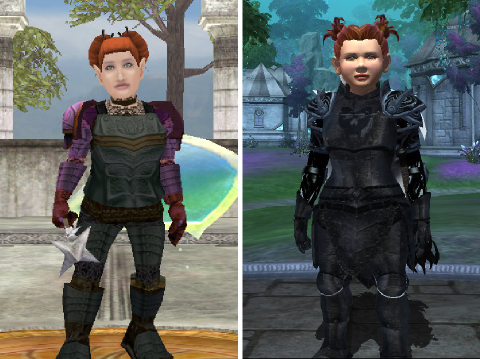
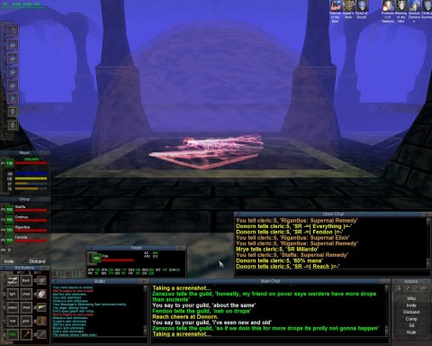
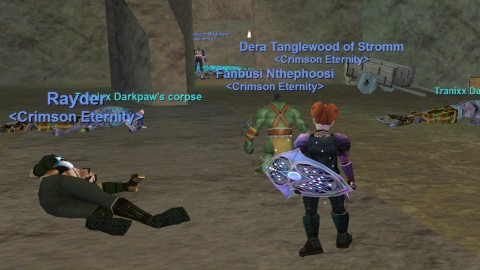

Back to: [West Karana](/posts/westkarana.md) > [2013](/posts/2013/westkarana.md) > [July](./westkarana.md)
# EQ: Why I stopped playing EverQuest

*Posted by Tipa on 2013-07-03 07:20:09*

[caption id="attachment\_10944" align="aligncenter" width="480"] Dera Then and Now[/caption]

I had this concept of going through my EQ characters that had corresponding characters in EQ2, tracing their experiences through the two games. First up: Dera, my halfling cleric. Everything was going along smoothly until I actually logged in to EverQuest to get a better screen shot. Soon I found myself in an AE group in a temporarily-uber version of Blackburrow. And then I remembered what I hated (and liked) about the MMO granddaddy.

I rolled Dera up when one of the last new non-transfer PvE servers, Stromm, came online at EverQuest's peak. My rogue on the Erollisi Marr server was being left out of raids because too many rogues, and as a Pacific time player in an Eastern time guild, getting home from work early was tough.

So while I waited for a raid spot to open up, I would be playing a newbie cleric on another server on another account. Clerics were in wild demand on the new server, and I was soon invited into a casual raid guild, Lost Sock Patrol. We weren't uber, but we weren't terribly far behind the curve, either. LSP reached our peak when we awoke the Sleeper, switching Sleeper's Tomb from the classic loot table to the new, less uber loot table, and earning us the spite and hatred of the entire server.

[caption id="attachment\_10945" align="aligncenter" width="480"] Just before waking the Sleeper[/caption]

We managed to stagger on for awhile after that, but the uber guilds in their wroth destroyed us on the forums and poached a lot of our people, and in the end the guild was dead and I moved to Viking Alliance, where we continued raiding up through Plane of Time.

I was missing my friends back on Erollisi Marr, though, so when the option came to be able to transfer servers and keep your gear, I transferred from Stromm to EMarr and rejoined Crimson Eternity, this time as a cleric.

There was ALWAYS room for a cleric. And a cleric was what I played until EQ2 came out, and I starting playing that game -- as the cleric, Dera. (And later as the bard, Tipa). I played both games for awhile before finally moving permanently to EQ2.

[caption id="attachment\_10946" align="aligncenter" width="480"] Last night, in Blackburrow[/caption]

The fall of EverQuest was gradual. The uberguilds were bleeding players who couldn't keep up with the grueling schedules as they left school and started real lives. Same thing was happening to second tier guilds like Crimson Eternity. Worse, in a desperate bid to stay alive, the uberguilds were lowering their requirements enough to attract second and third tier raiders hoping to end their raiding careers in an uberguild. EMarr's remaining uberguiid, Magister, had lowered their standards far enough that they were even recruiting players we'd rejected. That worked as well for them as you'd expect. They vanished, and EQ downsized itself to no longer require fifty to seventy people for a raid. New raids would be smaller. The era of the uberguild was over.

Our EQ1 guild has maintained a huge presence on Facebook, and has recently started trying to recruit its now older, wiser, now more casual membership back into the game. When I logged Dera on last night and found her guildless, I searched for guild members and got an invite back. An invite into a fellowship (kind of a meta-group) came, and I soon found myself in Blackburrow. Blackburrow, the starter dungeon for characters that started in Qeynos and Surefall Glade back in the day. A dungeon now filled with high level gnolls -- as high level or higher than Dera's 75 levels, anyway.

Nitemarex was pulling as much as he could handle and AEing them down. Every few minutes he'd show up, kill a few dozen, and I'd get a few more AA. Meanwhile, I tried to make sense of all my spells and abilities. Unlike EQ2, you only get to have about ten spells available at once. An ill-timed heal left me dead, but I made back the small xp loss quickly enough.

So there I was, sitting in one spot while someone else brought mobs to me. Occasionally I'd heal. I was browsing the web, texting a friend, watching a little TV on my iPad, and I remembered then what really bugged me about EQ.

It was always like this -- just sitting in one spot, grinding AA, while wondering why I was wasting my precious few days on this Earth staring at a screen, being bored out of my skull. Raiding was fun, I loved that, but this grinding xp, grinding those hundreds and thousands of AAs necessary to complete the latest content -- I just can't do it any more. I never could. I always was the last to level, the one with the fewest AA, because the pull and sit style of gaming was just too dull. The conversation was decent, when it happened, but mostly everyone was just quietly zoning out, and conversation would die and we'd just do our bits in silence.

The camaraderie of the foxhole or something.

So, anyway, back in EQ1, back in CE, dunno what they expect me to do now. My rogue, Tipa, still has at least fifteen levels on the cleric, so would be closer to current content. But I dunno. I think EQN has the possibility of not killing EQ2, but EQ has got to be seeing the grim reaper around every tombstone at this point. SOE can't possibly plan to run three versions of EverQuest at once -- can they?
## Comments!

**[bhagpuss](http://bhagpuss.blogspot.co.uk/)** writes: I'd bet the EQ playerbase as it is now (and it's still substantial) will largely ignore EQNext. I'd bet a goodly proportion of them won't even notice it's there even after it launches and even if it's a huge success. They play the game they know and they have the game they want, or near enough.

I'd also bet that as long as Smed is in charge and there are enough players to half-fill even one server EQ will not be switched off. It's his First-Born, and anyway he's on record as saying he sees no reason why MMOs should ever come to an end and SOE's longstanding practice backs that up. The only MMOs they've closed have been IPs they licensed or ran on hardware that was obsolete.

One thing I think all MMOs should do if they do close is offer, preferably for free, a memorial package with a small offline client that showcases a selection (your choice) of characters in a zone from the game. Kind of what Rift does with the characters it locks on those "trial" servers it's keeping in limbo until the last player leaves and they can switch the server off, only on your PC.

As for EQ gameplay, sit&pull was only one of many options, albeit one I personally enjoyed a lot. I sorely wish modern MMOs had it as a viable leveling option. And I was on Stromm from launch too. My highest character in EQ is still there - 84th she is. And because Stromm eventually combined with Luclin, all my Luclin characters are there too.

---

**[A bit quiet around here | The Late Telonite](http://telonite.wordpress.com/2013/07/05/a-bit-quiet-around-here/)** writes: [...] Call it lazy if you like, but I feel it’s more like a change of perspective that comes with age. Tipa says it very well in her article on why she left EverQuest. [...]

---

**[EverQuest Next &#8211; What We Know So Far | EverQuest Next Guide](http://www.eqnextguide.com/news/everquest-next-what-we-know-so-far/)** writes: [...] EQ: Why I stopped playing EverQuest [...]

---

**[stingite](http://iamstingite.blogspot.com)** writes: *insert random memory of staring at the spellbook while watching health bars in the Overthere*

---

**[From EverQuest to EverQuest Next &#8211; 15 Years of MMORPG History | Another EverQuest Next Blog](http://eqnextblog.wordpress.com/2013/07/12/from-everquest-to-everquest-next-15-years-of-mmorpg-history/)** writes: [...] EQ: Why I stopped playing EverQuest (westkarana.com) [...]

---

