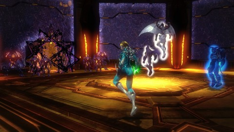

Back to: [West Karana](/posts/westkarana.md) > [2013](/posts/2013/westkarana.md) > [July](./westkarana.md)
# DCUO: Justice at last....

*Posted by Tipa on 2013-07-08 06:52:10*

[caption id="attachment\_10949" align="aligncenter" width="480"] Objection Overruled[/caption]

I haven't written about DCUO in awhile, not because we haven't been playing. We've been playing every week. I haven't written about DCUO in awhile because we've been working on one particular instance, the South Gotham Courthouse --- and we kept losing. Now, we haven't attempted the court house every week; it's been a spotty summer, with people having other obligations some weekends. But every Sunday when we did meet up as a full group, the South Gotham Courthouse would be the daily double... taunting us.

In this instance, players get a peek inside the ongoing digitization of the Brainiac-bottled buildings. With great effort, players are able to force their way through the barriers and into a staging area from which they can observe what's happening. Inside, two scorpion-like digitizers are assimilating, Borg-like, the normal humans who were trapped in the area when it was bubbled. They have set up four graviton generators which, among other things, have turned off travel powers like flight and super speed.

Our job is to disrupt the digitization and free the people. Unfortunately, we're a little late...

First job: clear the roaming packs of Brainiac robots from around the Courthouse. Second: Start pulling the digitizers. This is usually good for a wipe, and last night was no exception. Still, we managed it on our next try.

This brings us to the attention of the Supreme Justice, a bot at the very top of the court house. He demands we be put on trial for crimes against... BRAINIAC. We should just plead guilty, because I'm pretty sure committing crimes against Brainiac is Team Spode's mission statement. First, though, comes jury selection.

There are twelve spots on the jury, and both we and Brainiac will try to select jurors from our own camps. Pre-assimilated humans are imprisoned along the edges of the zone, along with mechanical Brainiac jurors. We need to kill bots bringing Brainiac jurors while also gathering human jurors. The challenge is to stack the jury entirely with humans. If Brainiac stacks it with bots instead, we lose.

Usually Spode goes out and grabs jurors while Kaptain KY, Sting and I kill incoming Brainiac jurors. After we collect six human jurors, the Bailiff spawns, a powerful bot that will harry us as we try to continue filling the jury box with humans. We killed him with three spots still open in the jury box; they were immediately filled with bots. So next time -- if there is a next time -- we have to keep him alive until we have all twelve spots filled.

[caption id="attachment\_10950" align="aligncenter" width="480"] Prosecutor and Defense Attorney[/caption]

Next step is turning off the graviton generators by using hop pads at the corners of the courthouse to access them. A little bot killing and generator disabling, and we're able to fly again. Flight is the only way to reach the Supreme Justice -- but before we can meet him, we have to make our arguments to the court. Arguments that can only be argued one way -- by killing bots.

The investigations and briefings in the area tell of the last human moments of the prosecutor and defense attorney before they became brain dead zombies with a thirst for the living. It's too late for them. The Supreme Justice has ordered them to perform a kangaroo court parody of normal proceedings, where both the prosecution and defense are working for Brainiac. The three bot jurors rise up against us as we kill bots bringing evidence in order to make the defense attorney (who really should be working FOR us) vulnerable, or kill bot witnesses in order to make the prosecutor vulnerable.

It's a long fight, but my control powers work well against the jurors and I still have plenty of time to work on the witnesses and keep power flowing to the others. We've done this fight so many times now that it's all a well-oiled machine at this point.

With them defeated, the Supreme Justice demanded our presence. This is our Waterloo. Our place of final defeat. Because there's a bunch of stuff going on, and a fair amount of randomness.

The Supreme Justice is a robed, gavel-wielding bot similar to the old EQ1 Seven Hammers. He initially comes with a bunch of powerful bots that must be immediately defeated. Periodically, he will unleash a special attack -- Jailing someone, who gets put into the center until several jailers are killed (if that takes too long, the person will die). Sometimes an executioner will spawn -- again, someone is put in the middle, the executioner walks forward, and if he reaches the prisoner, they die. Identical to the old EQ1 Plane of Justice trial :) Lastly, a selected person loses all their powers and must flip some levers to get them back. If this happens to the healer -- and it does -- bad things follow.

The justice himself is also a formidable opponent, with a devastating hammer spin and a hammer slam that hurts a lot. We got close a couple times, a couple times died right off, but then -- we did it. Smooth kill. After at least two months, we defeated South Gotham Courthouse and can move on with our lives.

We moved right on to the Tier 2 daily double, the HIVE Moon base. We've never actually done the hard mode version before, having spent a couple weeks on the easy mode version a long time ago. We kinda thought this would be easy, but we were schooled differently pretty quickly. Similar to the easy mode version, the break-in is really the hardest part. Once through that, the rest of the instance ran pretty smoothly, and the Queen Bee again showed just how little a threat she really is. Without Brainiac backing her up, she's nothing.

Compared to the rewards for winning a Tier 3 mission, Tier 2 rewards seem a little puny. Still, better than nothing. Ended the night several hundred marks up, above 900 if I remember right. Spode and Sting each have thousands saved away as they save for Tier 5 gear, but KY and I are still working on the Tier 2.5 gear sold in Center City.

Next week....? It's just a grind now, as we try to get the necessary combat rating to start on the Tier 4 instances.

## Comments!

**[stingite](http://iamstingite.blogspot.com)** writes: "After at least two months, we defeated South Gotham Courthouse and can move on with our lives." -- Slow hand clap for Team Spode from a member of Team Spode! Thanks for the post, Tipa! Really well written as always. :)

---

