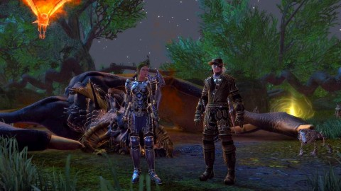
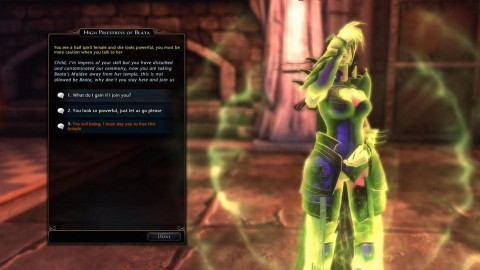
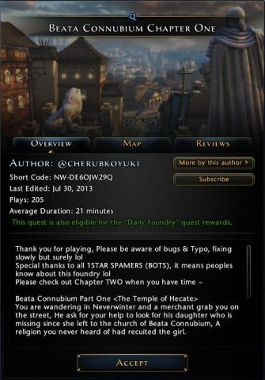

Back to: [West Karana](/posts/westkarana.md) > [2013](/posts/2013/westkarana.md) > [July](./westkarana.md)
# Neverwinter: Of Dancing Girls and Dragons

*Posted by Tipa on 2013-07-31 06:04:50*

[caption id="attachment\_10964" align="aligncenter" width="480"] Garrundar the Vile and friends[/caption]

All I really ever want from a Dungeons & Dragons game are dungeons and dragons. So many games emphasize the former over the latter, hiding those dragons away for a very long time. I think there's something primal in all humans that wants to battle a dragon, some monster that is such an ancient enemy that it has embedded itself into our very DNA. Jack Vance [wrote a story](http://en.wikipedia.org/wiki/The_Dragon_Masters) about meeting our ancient enemy, the dragons, on some distant world. Turned out they feared THEIR ancient enemy -- humans -- just as much. Epic battles ensued.

On our weekly outings, Trickster Rogue Kasul and I, a Guardian Fighter, seek out these dragons. We found one, Monday, in the skirmish where we had to meet and defeat a huge dragon, Garrundar the Vile, and his minions. Previously, it was a bit of a struggle to get balanced groups to fight these things, as the dungeon matchmaker would just throw random people into a group without any regard to filling roles. Now, it consistently fixes up balanced groups. As the game's defensive tank class, I always have the honor of taking all the damage, or trying to.

I remembered from the last dragon we fought to avoid its breath weapon. Even the Guard stance that lets me shrug off almost all damage from the front can't deal with that. Garrundar, or his minions, also has an acid pool spell. You have to keep moving. His minions include healers who heal the dragon and each other. It was a long battle to get those guys down. Toward the end, once the dragon was dead and we only had the minions to mop up, I had the bright idea to drag these healers away from each other, whereupon they died pretty quick. I'm not sure how I would communicate this to the other people, since Neverwinter never allows you a moment to chat; you're constantly hitting attacks and abilities. Nobody uses the integrated voice chat.

This is going to be a problem when we eventually hit the hard mode dungeons at max level. I've been reading up on these; they require specific classes to do specific things in order to complete them. Since nobody communicates, it'll be a requirement, as it is in most modern MMOs, that every group member has researched the fight and knows their role before they ever set foot in the dungeon for the first time. Inevitably, someone won't have researched it, and we will fail, and without being able to communicate, won't be able to explain why.

Even when NOT fighting, people don't talk, or very rarely. That's just the gestalt of random groups. Talking is the taboo.

[caption id="attachment\_10965" align="aligncenter" width="480"] Impress of our skill[/caption]

Each week, we look forward to diving into the Foundry, player-created adventures where regular players can unleash their creativity and tell their own stories with many of the same tools Cryptic's own designers use. Sometimes these dungeon-masters really surprise us with their storytelling, humor and adventure. And then there's adventures like this one, which started off asking people not to get on his case about his spelling mistakes.

If you KNOW your spelling is crappy, wouldn't you take steps to make sure you had a spelling checker work through your text? But, poor spelling was only the beginning of the issues.

[caption id="attachment\_10966" align="aligncenter" width="335"] Beata Connubium[/caption]

I guess I was one of the 1 STAR SPAMER (BOT)....

ANYWAY.... we were willing to overlook some spelling issues, but, come on -- author can't even write a single sentence. The plot, such as it is, involves saving a young girl recruited into a religion of naked dancing girls. We eventually discovered her undergoing a purification ritual -- a bath with a bunch of other girls. She refused to come with us until we yelled at her enough. Suddenly docile, she followed us through a bunch of fights against female deities from Greek, Roman and Egyptian mythology. We would occasionally have to answer riddles to get keys to open doors.

Last straw: randomly fighting The Hulk, the second to last boss. Because.... I dunno. Because why not? Our expectations were so low by that point. Kasul had predicted something like this, and neither of us were disappointed. I guess that Foundry where we fought Justin Bieber and Selena Gomez was even cheesier, but at least that dungeon master had been able to spell.

I don't think we'll be rushing to play the second chapter, though.

As of Monday, we're both level 43 and about to finish up Veliosk and move on to the Pirate Island. Kasul has mastered alchemy, leather craft and plate craft; I'm still struggling with leadership and alchemy.
## Comments!

**[mmoraven](http://www.mmoraven.com)** writes: I was wanting to ask you how the game is after the auction house exploit. Is the economy down the drain, or has it been picking up again? I'm also waiting for them to release more classes! Interesting read by the way!

---

