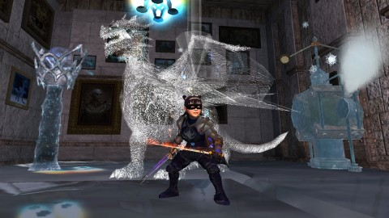
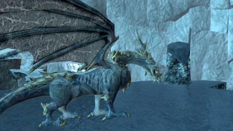
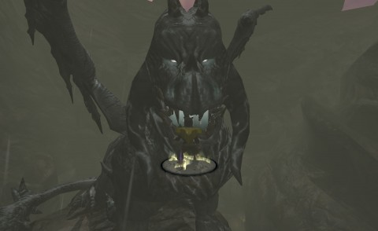
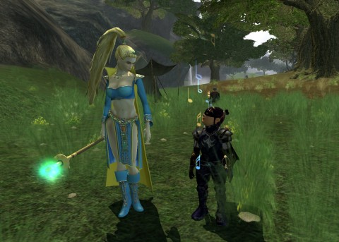

Back to: [West Karana](/posts/westkarana.md) > [2013](/posts/2013/westkarana.md) > [June](./westkarana.md)
# EQ2: Icy Keep: Retribution

*Posted by Tipa on 2013-06-03 07:01:17*

[caption id="attachment\_10931" align="aligncenter" width="480"] There's "snow" time like raid time![/caption]

Why has Tipa's storage room been transformed into a skating rink? Because she went on a raid. Yup, after many years, my ex-raiding troub who was abandoned when I quit the raiding life was back in raid chat once more. Sure, it wasn't current content, and Tipa is not yet max level or AA, but all they really needed for the raid were warm bodies... or more accurately, warm \_hands\_.

Tipa finished the Withering Lands quest arc, still somewhat short of the magic level 92 that grants access to Chains of Eternity and Scars of the Awakened, the two current paths to level 95. With a good half level to go, I did a quick Chelsith run -- \_sans\_ mercenary so I'd get the full xp -- and then I ran out the xp potion in Sebilis. There were surprisingly few people in Sebilis, for a weekend. The entire lower Sebilis was mine for as long as I wanted it. I had a chance to finish a few quests I'd had sitting in the quest journal since 2007. Chasing some nameds I saw on track, I clashed with another soloer in upper Sebilis, but I got what I came for -- level 92.

[caption id="attachment\_10932" align="aligncenter" width="480"] Vrrrewx[/caption]

I wasn't really eager to start on Chains of Eternity \_or\_ Scars of the Awakened. My berserker, Scatter, is so stupidly overpowered for all the solo content in both areas that I've seen all of both that I want to see. Nonetheless, I started on the CoE access because Tipa's got to get to 95 somehow. She's aided somewhat by all the level 92 gear Scatter's been farming for the past several months, which instantly boosted her to > 42K health when she leveled. Hence the change from the comfortable clothing she was wearing to the bad-ass outfit she now wears. Also, note the flamey sword she wields? That's a Soulfire blade -- \_another\_ quest finally finished, with help from a couple guildies. Hilariously, none of the Soulfire quest rewards have scout stats, since the stat readjustment awhile back made agility and stamina the only important stats for scouts. None of the scout-ready rewards had any agility at all. INT or STR, sure. No AGI.

[caption id="attachment\_10934" align="aligncenter" width="480"] The Withered Lands dragon[/caption]

Anyway, was starting on the CoE access, and reading on 80-89 chat where someone was trying to get a raid together to finish Icy Keep: Retribution. This is the raid at the end of the Frostfell winter content, taking players through a variant of Permafrost where you are to rescue a baby dragon from evil forces seeking to control it. The solo and heroic versions end with the dragon recaptured; the story finishes in this raid. Since this raid cannot be soloed, and requires at least six actual real players to complete, nobody does it anymore. The raid leader had been trying to complete the achievement for years. He was so desperate that even a level 92 dirge would be welcome.

All I would have to do was pull a switch at the right time.

That worked out pretty well. He shared the quest for the warm gloves necessary to allow the switch pulling, though I missed out on the larger quest through the zone itself. We worked through several bosses with a couple wipes as we learned the encounters, and our lack of any sort of heals (the healers had gone link dead, which is how there came to be spots opened up for Hamal and I) wasn't a real disadvantage -- until we met Vrrewx once more, and watched him transform from a cute baby dragon to a vicious killer intent on eating halflings, and anyone else.

This was not a fight that worked well without healing. I switched from dirge to inquisitor, and a kitty warden who'd gone link dead suddenly returned. With two healers, it was over fairly quickly. I combined the Epic E'ci tokens won both by Tipa and Dera and bought a lot of ice-themed stuff for Tipa's inn room. And that's how her storage room became Zamboni Land.

[caption id="attachment\_10933" align="aligncenter" width="480"] For those about to die...[/caption]

I was going to catch up with DCUO and Neverwinter in this same post, but I've rambled on too long about EQ2 for that. I'll have to post about THOSE adventures another time.

