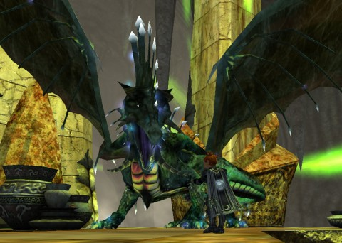

Back to: [West Karana](/posts/westkarana.md) > [2013](/posts/2013/westkarana.md) > [March](./westkarana.md)
# EQ2: Enervating my Epic

*Posted by Tipa on 2013-03-05 08:11:43*

[caption id="attachment\_10757" align="aligncenter" width="480"] Chatting with Delahnus the Dauntless[/caption]

> *Playing this game would be like steering a fifteen year old girl through the mall while she's shopping for crates.*

All-consuming and much missed gaming site Old Man Murray once famously wrote that [all games could be judged by their Start-to-Crate (STC) time](http://www.oldmanmurray.com/features/39.html), the "*shortest amount of time it takes a player to reach the first crate, which represents the point where the developers ran out of ideas.*"

In RPGs, MMO or otherwise, I'm always asking, how soon before I see my first dragon? I get impatient if it takes too long. EverQuest had one in the opening movie. Veeshan bringing life to Norrath was the first thing you saw. Must have been why I loved the game so much.

One of the things any character has to do, once they reach level cap, if not before, is to take their epic weapon and "enervate" it. This process removes the weapon's special abilities and turns them into skills and spells for you to use whenever you like. You also get to keep the debuffed weapon (to use as an appearance weapon, perhaps), and get a copy for your home display (my guild asks that members display their enervated epics in the Hall of Trophies).

Waaaay back in Sentinel's Fate, when the enervation quest was first released, groups had to form and successfully work through some of the most difficult group instances in the game, including "[Vasty Deep: The Vestigial Cella](http://eq2.zam.com/db/zone.html?eq2zone=96aebd116b5ee51f23a54fb7fc24869b)". This is a zone with a lot of tips on how to complete it depending on how well your group was geared, how many had their epics, what percentage had what tier of raid gear because IT WAS FRICKIN' HARD.

Through this two days of questing, I could have asked a guildie for some help. But knowing help was available if I truly needed it, I wanted to see if an under-geared new level 95 with a merc could "[molo](http://www.eq2flames.com/inquisitors/87667-favorite-merc-molo.html)" the whole thing. 

[caption id="attachment\_10758" align="aligncenter" width="480"] Chasing Toxxulia[/caption]

Some of these instances were instances I'd first seen randomly joining up with groups via the Dungeon Finder, which would drop me into instances I'd never heard of before, usually with just one other person as clueless as myself. We would blunder about, dying to stuff we didn't understand, until, confused, we'd give up. So I'd never actually gotten past the first boss in any of these places.

Good thing is mostly I didn't have to. I killed the main boss as pretty much my first kill in the Erudin Research Halls because I didn't know the entire point of the dungeon was to remove the special machinery keeping it from being killed. Dragged him out of his glowing green force field and got to the killing; whenever he would yell that he was now unstoppable, dragging him to another point in the room got it going again. When he died and I got the "sense of urgency" fast dungeon completion achievement, I was like, "whaaaaat?"

After that, I started looking up these dungeons before I blundered in.

[caption id="attachment\_10759" align="aligncenter" width="480"] Arda with Trophy Enervated Epic[/caption]

My long dungeon munging came to the Vestigial Cella, the final encounter of the whole epic quest, the one where I found five different strats, all of which pretty much said that without a fully committed group with decent gear, no chance.

Me and my merc: we rocked it. It did help that I knew exactly what would happen during the fight ahead of time, of course. I'd never have figured it out on my own.

I headed back to the guild hall to find places on my hot bars for the new abilities. An upgraded super group cure? Awesome. A self-only buff that proc'd heals? Perfect. These were the reason I did the quest, to get back these useful abilities. I proudly placed my trophy epic in the guild's trophy hall, then bought another copy from the vendor on the Nektulos Forest docks and placed the copy in my two-room inn room in the Jade Tiger.

I did my daily Dreadcutter and got a cool two handed staff with two yellow adornments. I had Scatter make me a Greater Essence of Runes and then visited the reforger in West Freeport to have it give my staff a glowy and to turn the double attack buff into decreased spell casting time. It's rare to see a magic weapon with a glowy effect anymore; people choose their own now via the reforger.

I was working on setting up the broker when I got an urgent request from a group of 90s in the challenge version of the Palace of Sabaton instance. Which I am clearly misremembering the name of, since I can't find it to link to it. Anyway, the group version was a fair challenge; it was one of the few instances I actually completed successfully with Arda when I was doing random dungeons at level 80. The level 90 one was harder.

The group said it was the raid version, but it was the normal version, just with the difficulty turned up to eleven. They were using a merc as the tank, and after the first pull, I knew that wasn't going to work, and offered up my own as the tank. And I was then the puller and the only healer and stuff. The smart thing to do, if I'd known they had no tank or healer, would be to log over to Scatter and just tank the thing myself. Scatter's AEs of Destruction are a joy to use. But, I want to start grouping with Arda. I am just twelve AAs from being able to group (there's a specific AA I need to have that is at the end of the prestige AA line). Might as well start now.

Once I understood the group's beastlord was suicidal and needed extra healing, everything went fairly well. There were a couple of overpulls that ended in wipes, but nobody got discouraged, and like groups do, we learned to work together and finished that thing. I had to cast a lot of group wards and heals, and when I got back to the Guild Hall after, I looked at ways to improve those heals. I hadn't paid them much attention, since I don't use them when soloing. Someone in the group had power regen, so I could keep casting group heals all day, with plenty left over to toss in a few encounter nukes to hurry things along (and these are spells I DO use, a LOT, while soloing).

By the time that was over, the timer for the Daily Dreadcutter was up, so I did it again. Emboldened by my success as group healer (and puller), I just dragged crowds of ogres to each boss and fought the boss, and the crowd, at once. My slow gearing up is trivializing even the CoE solo instances now (though admittedly Dreadcutter is likely one of the easiest; it's why it is now the preferred daily loot run for so many people).

So, that was EverQuest II last night. A mix of solo adventure and a fun group run.

