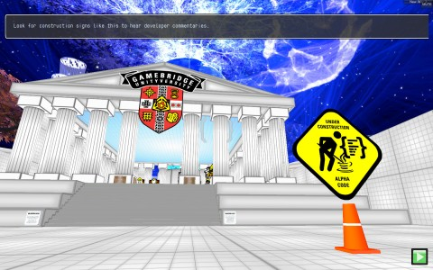
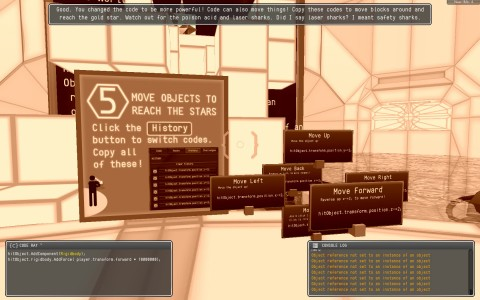

Back to: [West Karana](/posts/westkarana.md) > [2013](/posts/2013/westkarana.md) > [March](./westkarana.md)
# Code Hero (alpha)

*Posted by Tipa on 2013-03-06 07:50:23*

[caption id="attachment\_10771" align="aligncenter" width="480"] Code Hero Alpha[/caption]

Last year, or maybe the year before by now, I helped fund an innovative game on Kickstarter, [Primer's Code Hero](http://primerlabs.com/codehero0). This game would teach you to create your own games using the cross-platform Unity game platform, UnityScript and JavaScript. UnityScript, JavaScript and Flash's ActionScript are all closely related scripting languages, so knowing these things would be a Really Good Idea.

Instead of a more traditional approach, Code Hero is the world's first FPC (First Person Coder) game. You don't write a game. You create a game around you. With your Code Gun.

This might be the first shooter with a gun that doesn't destroy. Unless, of course, you set it to GameObject.Destroy(). Then, I guess it's like any other game.

[caption id="attachment\_10772" align="aligncenter" width="480"] Code Hero's humor: Doctor Evil by way of GladOS.[/caption]

Code Hero is set in a [Lawnmower Man](http://en.wikipedia.org/wiki/The_Lawnmower_Man_(film))-like virtual reality, guided by the ghost of Ada Lovelace, the world's first computer programmer. (Computing would remain a woman's occupation until the advent of electronic computers, but luminaries such as Grace Hopper would help it climb new heights even after).

You're soon given your Code Gun, a portal to a simple text editor and console that can run code in the current scene by pressing a trigger. It can also "shoot" special code signs to suck the code into the gun, where it can be stored, modified, and shot out again.

Once in the gun, the code can be extended with additional UnityScript to do what you like. Scripts and physics can be attached to objects in a scene editor mode. You can build a world around you -- just you and your code gun.

[caption id="attachment\_10773" align="aligncenter" width="480"] Code Gun editing screen[/caption]

Code Hero is still in alpha, so I'm not going to get into any bugs. You expect those. The developers have recently completed a "FizzBoss" challenge, an implementation of the famous "[FizzBuzz](http://www.codinghorror.com/blog/2007/02/why-cant-programmers-program.html)" basic programming test.

FizzBuzz asks programmers to write a program that prints out the numbers 1 through 100, each on a line of their own. However, if the number is divisible by three, it should instead print "Fizz". If the number if divisible by five, it should instead print "Buzz". But, if the number is divisible by both three AND five, it should instead print "FizzBuzz". Mention of this problem online is usually followed by programmers posting their solutions. And those solutions being wrong. Merriment ensues.

So, as a test of what you have learned thus far, destroying a boss by implementing the FizzBuzz solution in UnityScript is first rate. But, before I met the boss, I took the advice of signs in the boss' anteroom and went to brush up on my construction techniques. I sucked up the code to build some stairs and accidentally shot the code right next to me.

I was trapped, in the stairs. The stairs code was made of stretched, untagged, cubes. I wrote a routine to return the tags of any object I shot -- they were all tagged "Cube". I modified the script to destroy everything tagged "Cube", but I made a mistake and ended up in an infinite loop and had to shut down the game from the task manager.

That's the danger of getting inside your code. Infinite loops can ruin your day, and bad code can fall right on top of you.

[caption id="attachment\_10774" align="aligncenter" width="480"] Code can cause explosions![/caption]

I left feeling that I would have had a much better learning experience given a regular IDE and a test scene in which to experiment. I don't know what sort of IDE Unity developers normally use, but we use MyEclipse (for web development) at work and that gives a lot of help. For instance, there's an "Undo" key right there :-) And you can stop your programs, any time you like!

Primer wants you to learn the basics of UnityScript programming in Code Hero before moving into the Unity development environment for real. I'm not really seeing why you wouldn't just want to \_start\_ in the official UnityScript environment. The Code Gun is really just a visual copy and paste (with modify). You can do that outside your game just as easy. Easier.

However, a Portal-like game where the solutions were based on implementing algorithms instead of creating portals -- that could be fun. Some of the Code Hero challenges were exactly this -- for instance, building a bridge over a pool of acidic laser sharks. Lose UnityScript with all its braces and object-oriented syntax, come up with a simpler, more visual language like [Scratch or Blockly](https://plus.google.com/108460561201888322767/posts/G4tq1h14nYc), and turn players into coders, if not UnityScript experts.

## Comments!

**[pasmith](http://dragonchasers.com)** writes: Back in the 70's we play BizzBuzz, which was a drinking game that used those same rules. You went around the circle, counting upwards, and if you said a number rather than the required "bizz" "buzz" or "bizzbuzz" you had to drink.

I never really understood drinking games since usually you played them when your intent was to drink a lot. So losing was winning, sort of...

---

**[Tipa](https://chasingdings.com)** writes: Hey, I bet that's where FizzBuzz comes from! I wasn't even legally able to drink until the 80s :P I wasn't even legally able to drink at my WEDDING!

---

**[Brian 'Psychochild' Green](http://psychochild.org/)** writes: Funny hearing "Bizzbuzz" is a drinking game, as a Sunday school teacher taught us how to play it. If you messed up you'd be "out" and play would continue with the rest of the group. I think if you didn't say a number then the order would reverse.

Anyway, interesting writeup of Code Hero. I think you hit upon the right thing: instead of worrying about syntax, it might have been better to teach the basic concepts of programming. I think the quality programmers are the ones who understand the core concepts of programming (this is what a loop does, etc.) and then can apply that knowledge to whatever syntax they need to learn.

Too funny that an infinite loop makes the whole game hang! :)

---

**[Tipa](https://chasingdings.com)** writes: I have been missing out on the BIzzBuzz fun all my life, apparently.

Yeah, I was surprised Code Hero didn't sandbox the code; they send it straight to Unity.

---

**[mbp](http://mindbendingpuzzles.blogspot.com)** writes: Hi Tipa, I wonder if you would be able/ willing to give me a bit of advice. I have a 12 year old daughter whose talents combine analytic problem solving with artistic ability. She recently got into computer programming with Scratch and loved it. She also did a short course on html web page design. She is ready I think for a next step but I have no idea what that is. I am a hardware guy not software and my artistic ability is non existent. Something like a game designing framework that was a bit more sophisticated than Scratch might be the next step, I don't really know. Any ideas?

---

**[Tipa](https://chasingdings.com)** writes: @mbp -- take a look at Processing (http://processing.org/). It's a language built for games and graphic art that introduces concepts useful for moving up the chain to more professional languages.

---

**[mbp](http://mindbendingpuzzles.blogspot.com)** writes: Thanks Tipa. That sounds like what she needs. I will download it and show it to her and see what happens.

---

