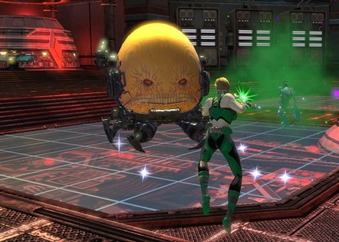

Back to: [West Karana](/posts/westkarana.md) > [2013](/posts/2013/westkarana.md) > [March](./westkarana.md)
# DCUO: He's a real metal man, sitting in his metal can

*Posted by Tipa on 2013-03-12 07:04:46*

[caption id="attachment\_10783" align="aligncenter" width="480"] I am the egg man[/caption]

What does it take to defeat the Tornado Tyrant in Oolong Island? Three weeks and nine levels. But that's done. After an impromptu mid-week play through some mission arcs, we all started our assault on Oolong Island Sunday at level 28 or 29. We flew through the early fights, which have become so familiar that we could just joke around and fly casual and have pterosaur barbecue, as much as we liked. Prehistoric drumsticks for \_everyone\_.

Soon, we were up against T. O. Morrow and his greatest failure/victory, the Tornado Tyrant. We blocked, we scattered, we killed the adds, we moved in for the kill and T.O.Morrow was a broken, broken man, though of course in the ending cinematic, he would claim this was all actually a victory, and the defeat of all the world's heroes was at hand.

[caption id="attachment\_10781" align="aligncenter" width="480"] Why are we not arresting this psycho?[/caption]

Time to see the end of the island and finish the green and blue collections! We flew up to the building of the final fight, battled bots like [Magnus, Robot Fighter](http://en.wikipedia.org/wiki/Magnus,_Robot_Fighter), and soon came face to shell with the Egg Man, ~~MODOK~~ Chang Tzu. He tried to fling us onto electrified floors, forgetting we could all fly. This guy is apparently the CEO of Oolong Island, the chief mad scientist, and yet he lets T. O. Morrow pretty much do what he likes.

We finished up the two collections and left.

What's next? Blüdhaven, the only American city with an umlaut in its name, the place from which all heavy metal music flows. One of Batman's many Robins decided to strike out on his own as the hero Nightwing, and do for Blüdhaven what Batman did for Gotham City -- turn the place into a dark realm that turned ordinary people into super villains.

Unfortunately, Nightwing has decided to hang out in police stations guarding the jail, or being captured by Brother Blood along with the other Teen Titans, and leaving Blüdhaven utterly defenseless.

Now, the living elemental of toxic waste, [Chemo](http://en.wikipedia.org/wiki/Chemo_(comics)), had invaded the city, completely destroying it, turning many of its citizens into half-mutated monsters, and leaving baby clones of itself everywhere.

Where was Nightwing? Who knows? If we managed to defeat Chemo and free Blüdhaven, would he pop in at the end and take credit? Of course he would! In all these missions, Team Spode gets sent in, some other hero pops in at the end and takes the credit. We're like the subcontractors of the hero world.

[caption id="attachment\_10782" align="aligncenter" width="480"] More HGH than Lance Armstrong, apparently[/caption]

The mini-bosses were easy, tank and spank. We died more on the trash, to be honest, especially in the toxic pools where it was very easy to get overwhelmed. I'm pretty sure I (as controller) should be dealing with that somehow -- I'll have to check out my power loadout.

The fight against Chemo itself was pretty fun. We escorted a bunch of hazmat-suited toxic waste cleaners to Chemo. During the fight, Chemo would start spraying toxins into the air, and we'd have to get close to one of the hazmat guys, who'd spray us clean. Then Chemo would attack the hazmat guy and we'd do more killing. 

That was the end of Chemo and the end of Blüdhaven. Nightwing showed up to take credit, of course, pretending like he'd been there the whole time (he had not). Team Spode finished up the area collections. Three of us had dinged 30 during the mission; Kaptain KY finished a quest afterward so we're all 30 now, ready to start on end end-game stuff.

End game is all about earning Marks of Triumph to buy gear to improve combat rating to earn access to higher tier adventures. I spent some time last night trying to earn a few more marks on my own.

None of us has done any of the Tier 1 group missions before. It's going to be a challenge, and we're going to have to quickly get to the point where we complete two Tier 1 missions a night in order to progress rapidly enough.

I bet it won't be that easy, though.
