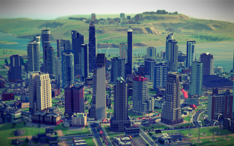
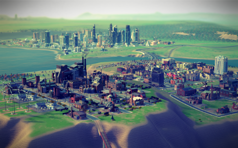
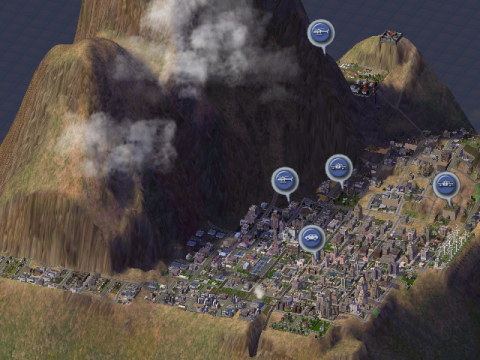

Back to: [West Karana](/posts/westkarana.md) > [2013](/posts/2013/westkarana.md) > [March](./westkarana.md)
# SimCity: The Game that Corrupted Hadleyburg

*Posted by Tipa on 2013-03-15 07:22:37*

[caption id="attachment\_10787" align="aligncenter" width="480"] Incorruptible Hadleyburg[/caption]

It's more than a little unfair to complain so much when I couldn't play SimCity 2013, and then say nothing once I was able to play it. So here's this post. I can play it and do enjoy it when I do; I'm playing in a corner of a region started by friends who fled to another server, so it's as close to a single player game as it possibly can be. I've started two cities and a Great Work -- an arcology. I've lost sleep just doing one... more... thing.

For all SimCity's new shine, though, it doesn't let me be very creative. Following the various missions the town residents ask makes for a very linear game, and all the freedoms you gain with curvy roads disappears once it becomes clear that a rigid grid system -- with \_avenues\_ -- is the only way to maximize your population and income.

SimCity isn't as complicated a game as it appears. You don't need industry, for instance. There's this balancing game with industry and pollution. When I saw what industry was doing to [Hadleyburg](http://www.gutenberg.org/files/1213/1213-h/1213-h.htm "The Man That Corrupted Hadleyburg"), I just bulldozed it all and replaced it with commercial and, where the ground pollution wasn't bad, residential. City progressed fine; better, even. The yellow "need more industry NOW!" gauge is pinned to the top, but the town is above 100K people, making decent simoleons, and apparently all the sims have found that just taking their car out and sitting in traffic all day is just as fun as getting your hand cut off in some metal press machine.

[caption id="attachment\_10788" align="aligncenter" width="480"] Shoes for Industry[/caption]

I started [Shoes for Industry](http://firesigntheatre.com/media/media.php?item=sfi) to take up the industrial slack from Hadleyburg, but not one Hadleyburgian has made the commute. Traffic, probably. Takes ten-fifteen minutes for the recycling trucks to make it from the trade depot to the arcology.

Shoes is set against a plateau, home to a bunch of industry and two powerful wind farms. I had the thought that the industry would convert to clean industries once I built the university in Hadleyburg, but that hasn't happened yet. Probably because school buses get stuck trying to get into Hadleyburg. Education, you see, increases the tech level of your industry, and makes it cleaner. Hadleyburg is so educated that people recycle their toenail clippings in specially marked bins, but the rubes of Shoes for Industry still consider squirrel fights good family entertainment.

Since I played Hadleyburg the wrong way, building it around a giant circular avenue surrounding a park, I have to make a difficult decision. I had this vision of tall skyscrapers looking down into this circular Central Park and being awesome, and a line of tall hotels lining the coast. Unfortunately, this doesn't make for the best traffic flow, and buildings can't be built with the best density along curved roads.

So, I either let Hadleyburg level out at about 100K people and keep my current city plan, or bulldoze all the fun out of it and make a rectangular grid city like the game wants.

I think I'll just continue to ignore what the game wants. It gives bad advice and anyway, I just want to play the game the way I want to play it.

The individual life of the sim, a feature much touted, is really boring, unless they're driving. Following a sim who is supposed to be driving to a store just end up taking a really roundabout route everywhere and sitting in traffic for hours to get to a place that was only a couple blocks from his starting location is hilarious. Since the sims refuse to take detours along the roads I built just to ease congestion, I bulldoze the extra roads. More room for building stuff.

[caption id="attachment\_10789" align="aligncenter" width="480"] Darkedge[/caption]

Compare a standard SimCity 2013 city with this one from my SimCity 4 game. In SimCity 4, I have built a city around a really, stupidly tall peak I terraformed. The residents live in shadow most of the time. Industrial pollution really doesn't have anywhere to go. Crime is a big problem. But people struggle on, and manage to get around the city without creating huge traffic jams, and I never have to raze the downtown to put in adequate streets.

But even given that I have SimCity 4 available right there -- even just ran it to take the screen shot -- I like SimCity 2013 as much because it is just a lot prettier.

Now, combine all the graphic goodness of SimCity 2013 with all the depth of SimCity 4, and you'd have yourself a great game that would stand the test of time until EA/Maxis turns off the servers in a couple of years.

## Comments!

**[bhagpuss](http://bhagpuss.blogspot.co.uk/)** writes: Seeing "Shoes for Industry" made me sit up. I thought for a moment you'd named it after the long-forgotten art-punk collective of the late 1970s, who I saw several times and who had one of the most disturbing stage acts of the day. The moment when the singer seized both sides of his head by the hair and tore his scalp open to reveal his brain will live with me forever.

No video of them anywhere on the interweb that I can find, sadly, although their slim recorded output is easy enough to find. I did know they were named for the Firesign Theatre routine but I'd forgotten.

---

**[Stargrace](http://mmoquests.com)** writes: Aw, people had no choice but to start over on a server they could actually play on, I'm sorry for that though. NA East 3 has been wonderful since the change, but even there we had to abandon one region and start another because 4 people who had settled there suddenly found their cities so glitched that they couldn't play. I would love it if you played on NA East 3 too, so I could invite to the region.

---

**[Was Anything Learned from SimCity? Should Anything Be Learned from SimCity? | The Ancient Gaming Noob](http://tagn.wordpress.com/2013/03/27/was-anything-learned-from-simcity-should-anything-be-learned-from-simcity/)** writes: [...] fans were discovering that the simulation itself was not all it seemed on the surface.  Sims seem somewhat dim, and the depth of the game doesn’t seem to be up to past standards, not to mention the simple [...]

---

