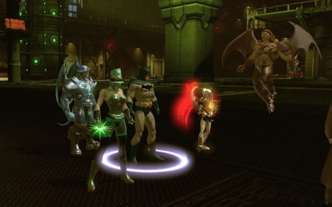
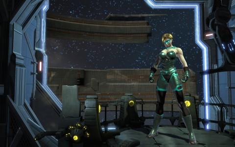

Back to: [West Karana](/posts/westkarana.md) > [2013](/posts/2013/westkarana.md) > [March](./westkarana.md)
# DCUO: Ace Chemicals, Vat Defective

*Posted by Tipa on 2013-03-18 06:46:37*

[caption id="attachment\_10792" align="aligncenter" width="480"] Chemo[/caption]

Patrolmen. We can deal with violent experiments that survive on toxic waste. Special security patrols, giant, venom-infused hounds and their masters, no problem. But if you want to see Team Spode start to panic, send in an Ace Patrolman with his Flamethrower of One Hit Doom.

Last night was Team Spode's first try at a Tier 1 group mission, the beginning of DC Universe Online's end-game. Having leveled to 30, the game now ignores your level and bases every encounter on your "combat rating", the game's version of World of Warcraft's gear score. During the past week, we've been separately working on our gear. The Tier 1 solo missions give some Marks of Triumph -- the Tier 1 gear currency -- some faction, and usually a piece of very decent gear on their own. Additionally, there are a set of three related missions in Gotham City that give fifteen marks per day, and the daily Vault lotto mission that occasionally gives 25 marks.

We were semi-prepared for the night, with many of us already sporting several pieces of T1 gear.

[caption id="attachment\_10794" align="aligncenter" width="480"] Guess who shows up at the end...[/caption]

The Ace Chemicals mission brings together two old favorites from our pre-30 days; T. O. Morrow from Oolong Island, and Chemo from Blüdhaven. Morrow has come to Gotham City at the Joker's request to develop an improved version of his toxic gas. Unfortunately for the Joker and for Gotham City, Morrow has opted to double cross the Joker and is experimenting on the Joker's henchmen to create a better breed of monstrous human. Both heroes and villains just want Morrow to go away.

This is what Batman tells us as we traveled to the abandoned Ace Chemical factory, anyway. Batman would clear the place out himself, of course, but he has wicked allergies and also his niece has a dance recital that he really has to go to. Only Team Spode, Substitute Superheroes For Hire, can take on this important task and save Gotham City.

We immediately find that the transformed security patrols within the factory are not clowning around. Our first pull ends in a wipe. And when I say pull, I mean rushing in with guns a-blazing. We regroup and use Kaptain KY's pull attack to pull a mob at a time, but his combat rating is too low for that attack to reliably hit. We gingerly pull a few at a time and make it to the central room where Chemo lies quiescent in his harness, worked on remotely by Morrow in his sealed control room above the fray.

The place is a mess, his hair looks awful, he doesn't have time to kill us himself, time to unleash the security patrols.

This goes fine until the Ace Patrolmen open up with their flamethrowers and roast us all. Again and again and AGAIN this happens until our gear is pretty broken and we're forced to return to the local police station to repair and regroup. We start the instance over, and same thing happens, though we get much further when we all shift to the damage role. This strategy was suggested by friends Doctor Apocrypha and Seeker Elru, and with vastly increased DPS and Stingheal's out-of-role heals, as well as a rapid focus on Ace Patrolmen when they spawn, we finally cleared the first encounter.

We then took a trip through the factory to a mini-boss and then back to the central room where we faced more security waves. Out to another mini-boss -- a boy and his dog, how lovely -- back in for more security waves. Out to one last mini-boss, I think? And back to the central area, but this time, Chemo has broken free.

Chemo sends out crowds of low-health Chemlings to carry barrels of chemicals to him. It's a race to kill 25 chemlings before Chemo receives enough barrels to construct more powerful Chemoids to attack us. We waste time battling the Chemoids and wipe one last time.

We return with a renewed focus; kill Chemlings fast, ignore Chemoids, kill Chemo when he becomes active. That strat wins the mission for us.

Batman, woozy on Benadryl, and Commissioner Gordon stop by to hand us some loot and thank us for our really high repair bills with a case full of marks. After a quick pass for any stray interrobangs or briefings, we head back to the Watchtower to trade in our marks for some more T1 armor.

[caption id="attachment\_10793" align="aligncenter" width="480"] Teal Lantern[/caption]

Teal Lantern is able to afford her fourth piece of T1 gear, bringing her up to Combat Rating 40. Just a few more points before she can start working on T2 gear. Stingheal is even closer, and he's trying to figure out the fewest number of marks he can spend on T1 gear to get his CR to the level required to start on T2 gear. This will be the first piece of T1 gear for both Lord Spode and Kaptain KY.

I also got, as a random drop, some controller pistols that were a huge upgrade over the brawling gloves I'd been using since day one, so now I'm using the same weapons as my villain, Nurse Göbbels, which should make keeping the combos straight a lot easier.

With the win of another wire spool table, I finally was able to place the twentieth item in my base and open up free placement mode. Three gigantic Valentine's heart-shaped hot tubs now decorate the base. Because Teal Lantern needs to stay very clean. I haven't unlocked anything yet; I may take my next set of marks and buy the sidekick enhancement. I don't really need to start work on T2 armor this week.

Next week: another T1 instance. It'd be fine with me if it turns out to be Ace Chemicals again; now that we know the fight, we'd probably win first try next time. But odds are, it will be one of the others. In which case I'm hoping for Smallville.
