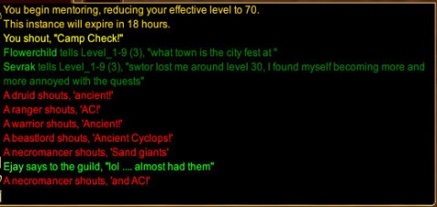
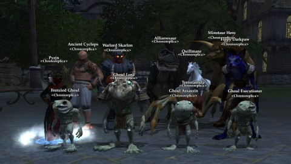

Back to: [West Karana](/posts/westkarana.md) > [2013](/posts/2013/westkarana.md) > [March](./westkarana.md)
# EQ2: How to spawn the Ancient Cyclops

*Posted by Tipa on 2013-03-22 06:43:20*

[caption id="attachment\_10797" align="aligncenter" width="480"] Camp Check![/caption]

First step in spawning the Ancient Cyclops in EverQuest 2 is to go back in time about thirteen years and log in to the original EverQuest. Journeyman's Boots, one of the most highly prized items in the game, would give characters a decent instant speed boost in a game where most characters could not get anywhere quickly. JBoots, combined with a snare spell or ability, could allow most classes to solo in a game focused on groups. 

Druids, however, could both snare, give themselves a run speed buff, and solo. Everyone hated druids. So could bards. Everyone loved bards. Go figure.

JBoots used to drop from Drelzna in Najena's Lair, which meant waiting in line for days (literally. days.) for a chance to join the Drelzna camp. Verant came to their senses and made it a quest, and the rarest part of the quest was getting the ancient ring from the Ancient Cyclops. Almost everyone wanted JBoots, and if you already had them or didn't need them, you would want the ancient ring to sell to someone else. (Almost everything in vanilla EQ could be dropped or traded).

Once you've experienced what it was like in the elder game, come back to present day and enter the chronoportal in the Sinking Sands.

[caption id="attachment\_10798" align="aligncenter" width="480"] AC camped![/caption]

Camp check. You have your necro fear kiting sand giants. You have your ranger trying to track the AC. You have everyone at their favorite camps killing placeholders. And you have a thousand different guaranteed, sure-fire methods of spawning the Ancient Cyclops.

[caption id="attachment\_10799" align="aligncenter" width="480"] Let's try killing desert madmen![/caption]

As far as anyone thought in vanilla EQ, Ancient Cyclops and Terrorantula were rare spawns off wandering monster spawns, so if you killed every wandering monster in South Ro, you'd eventually spawn both names. Terrorantula silk from Terrorantula sold pretty well; it was required for some armor quests. The AC was such a rare spawn that there was some disagreement over exactly which spawn spot spawned him. Generally people tried to keep everything dead.

[caption id="attachment\_10801" align="aligncenter" width="480"] Kill-stealer![/caption]

In EQ2's version, you kill all the spiders, wandering madmen and mummies in the zone to spawn the AC. Every NPC in the zone starts attacking it, hoping to get the ancient ring for themselves. In vanilla EQ, the first person to click the corpse when a monster died got to loot it, regardless of who killed it. They later changed it to the character or group that did the most damage to it. Both methods were exploited by unscrupulous characters. Wizards, for instance, would run around kill-stealing nameds by casting manaburn on them while a group was fighting them.

Ah, memories.

Just as the AC spawns, Terrorantula ALSO spawns, and kills the ranger. In EQ, the ranger always died first. Rangers were good luck charms on a raid; once a ranger died, you knew the Loot Gods were smiling upon you. We had a ranger squad in our guild; they were drawn together by their shared suffering, but it was a sight to see when they'd line up together in North Temple of Veeshan to kill dragons.

In EQ2, ignore the AC and kill Terrorantula. AC will finish with the NPCs and come attack, and now he can be killed.

[caption id="attachment\_10802" align="aligncenter" width="480"] The Chrono Squad[/caption]

Clearing a chrono-portal earns you ancient platinum coins which lets you buy a replica of the old-school mob for your home, as well as some books and paintings of EQ1 scenes. I had to catch them all, and here they all are, gathered together outside my South Qeynos home. I couldn't place them with my chronotask replicas inside, because they are too big and cannot be resized.

The Ghoul Lord and friends are from the Moors of Ykesha. Pyzjn is from Enchanted Lands. Fippy Darkpaw is from Antonica. Quillmane is from Thundering Steppes (try to ignore the tears of the mage working on their epic as you kill the mob they waited a week to see). Minotaur Hero from Steamfont. Warlord Skanlon from Lavastorm. Ancient Cyclops and Terrorantula from Sinking Sands. And Allizewsaur is from the Feerrott.

The nameds don't always drop their special item, so gonna have to go back a few times to get them all. I think I only got the Fabled Glowing Black Stone from Pyzjn and the Fabled Flowing Silk Sash from the Frenzied Ghoul. I got a nice looking sword from Fippy, who had no particular drops in EQ1. Not sure what to expect from Allizewsaur, since he only dropped valuable gems for crafting, but no special loot.

Nonetheless -- fantastically fun event that really does give a feeling for what EQ was like, back in the day. Walked there uphill both ways, you know. And also, get off my lawn.

## Comments!

**Killington** writes: Long live EQ1! :D
I might have to load up EQ2 again to check these out, thanks for the tip!

---

**Cogg** writes: Originally, J-boots didn't drop at all, they were the reward of a long and pretty difficult quest that took you from Najena to one of the islands on the boat ride between freeport and kaladim, to the raithe mountains (I think? it's been a long time) and more.

---

**Cogg** writes: Actually I got it backwards, you are correct. :S

---

**[Tipa](https://chasingdings.com)** writes: It was a pretty legendary camp :P

---

