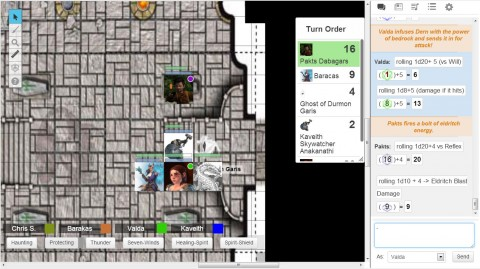

Back to: [West Karana](/posts/westkarana.md) > [2013](/posts/2013/westkarana.md) > [March](./westkarana.md)
# D&D4e: The Story of the Ghost

*Posted by Tipa on 2013-03-29 06:43:47*

[caption id="attachment\_10809" align="aligncenter" width="480"] Ghost Encounter of the Blurred Kind[/caption]

As a shaman, talking with spirits is what the dwarf Valda Onyxheart does every day. It's in her \_wheelhouse\_. To be attacked by the \_hentai\_ tentacles of a ghost when she was just trying to make some sort of spiritual connection ... well, some insults just can't be borne.

It's been a month since the Adventure Company last met, but only minutes have passed in the tunnels beneath a village surrounded and attacked by the undead. The villagers we have promised to protect have barricaded themselves within an old church; we are scouting the tunnels beneath the village for a clear path to a graveyard and an escape.

The tunnels so far have not been empty; zombies and skeletons wandered around, but we killed them dead. Deader than they were. We killed them \_more\_.

A light breeze from the east stirs the dust; we cautiously check the other passages and find no other exit, and decide finally to enter the mausoleum and find the source of the wind.

The mausoleum is dark. Tightly sealed sarcophagi (sorry, sarcopha-*people*, let's not impose gender roles onto them) line the walls. Fire pits mark the location of ancient ritual flames, but they are long since dark.

The goliath Kav thinks he sees an oily smear in the air to the north, but finds nothing except some dust swirling in the breeze. The tiefling Barakas checks the coffins to the south, but sees nothing.

We discuss, for a few minutes, whether we should head back to the chapel and bring the villagers to this place of relative safety. Since it has only been a few minutes, though, we decide they can take care of themselves for a little longer while we ensure the path to safety is clear. The breeze tells us we must be close.

We head east, toward the source of the wind, but are stopped as an insubstantial presence coalesces in front of us. It's a ghost! We can make out that it is humanoid, was once perhaps a human, but seems agitated now because, ghost.

Kav tries speaking to it, but gets little of value from it. Valda uses her *Speak with Spirits* power to improve her *Insight* and tries to discern more about the ghost and the meaning of his presence here. She gets his name from him -- in life, he was Durmon Garis, a protector of the village who died to an orc invasion -- but as they speak, he becomes more agitated and a darkness overtakes him. He lashes out with a tentacle of inky black.

It's ghostbusting time.

Kav tries a couple of tentative attacks and finds that his hammer can harm the thing; dark tentacles assail him and then his fears take control and send him fleeing. The gnome Pakts fires blast after blast at it, while Barakas weakens it with the ever-reliable Magic Missile. Valda does the best she can, directing her spirit companion, the basilisk Dern, to try and catch the ghost's attention, but Durmon's spirit ignores it. Aside from a couple of hits, Dern is mostly powerless against the ghost.

Kav overcomes his fears and runs back into the fray. The ghost knocks Kav and Valda back with a tentacle blast; Valda catches her second wind and sends some healing Kav's way as well. The ghost eventually weakens; Barakas pushes it away with a bolt of force, but that only has a temporary effect. It vanishes and re-appears again in front of Kav.

We eventually dissipate it enough that the darkness that infected the spirit is driven away. For a moment, the ghost of Durmon Garis stands before us shining; a bright spirit clad in armor. He thanks us for setting him free, tells us to "seek the claw".

The ghost then vanishes utterly and forever, opening the way for us to continue east. There's noise from behind us, though, the sound of two people running in fear.

It's the two children from the chapel; moments after we left, the undead surrounded the chapel and crashed through every window. The adults battled briefly, but could not hold back the horde. At least they could keep the children safe; they handed the boy the village's crossbow and locked them both into the tunnels beneath, ordering them to find us and stay safe.

As the door locked behind them, the children could hear the sudden screams of their families as they were torn to shreds.

We vow to protect them and bring them to safety. The boy knows of a cave a couple hours travel east, through the forest. But not the forest that is infested with undead hordes. That's the forest to the west. Forest to the east is safe... probably. The cave is used by the villagers for outings.

Next week: Escape into the Probably Safe Forest.

