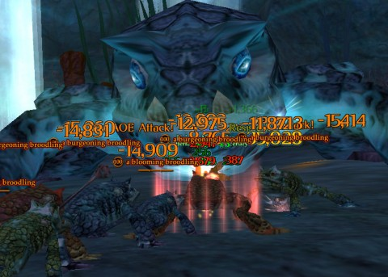

Back to: [West Karana](/posts/westkarana.md) > [2013](/posts/2013/westkarana.md) > [May](./westkarana.md)
# EQ2: Scars of the Awakened: Day 1

*Posted by Tipa on 2013-05-01 06:54:57*

[caption id="attachment\_10850" align="aligncenter" width="480"] Frog Wars[/caption]

It's an issue whenever the EQ2 team brings back one of EverQuest's classic zones: how close have they come to the original experience? And, secondly, does it mesh well with the "shattered lands" lore that backs EverQuest II?

Game Update 66, AKA "Scars of the Awakened", bring back Cobalt Scar and Siren's Grotto. The original Cobalt Scar was the final outpost on the discovery tour all characters had to make through Velious before they earned full use of the druid rings. It opened up the Claws of Veeshan-faction areas, the third faction of Velious' three-way war between the giants, dwarves and dragons. The completion of the gnomish expedition plotline -- the gnomes who rediscovered Velious the FIRST time -- awaited the crossing of the deadly open dungeon of Siren's Grotto.

In Scars of the Awakened, the returned vestiges of the Combine Empire and the exiled tribe of the otter-like Othmir that we met in EQ2's Great Divide and Withered (nee Wakening) Lands have broken through the rocky barriers that hid Cobalt Scar. They've found themselves at the wrong end of a battle between the remnants of the native Othmir and the walrus-like Ulthorks, armies of undead, necromantic dragons, hungry giant drakes, and beguiling sirens.

They are completely overwhelmed. And only you can save them. Seriously. YOU are the "Mortal Champion" and without your help, they are doomed. It's lucky you're a hyper-competent bad-ass, setting the supply camp in shape before going on to save the Othmir and prepare the Combine main camp to withstand attack from the ever-circling drakes.

A high-level tradeskill has never been more important, as crafting various items drives several plot lines. In my first night, I focused largely on the tradeskill quests, so I'm not any sort of expert on how the adventuring lines play out. There's some poisoned Othmir I have to save yet.

But, as for the tradeskill quests -- track harvestables, summon crafting stations, these are your friends. Bring lots of effulgent fuels as well, and harvest all the nodes you see. Most quests reward you with Mysterious Blue Tokens, with which you can buy [Scars of the Awakened-specific crafting recipes](http://www.eq2designgallery.com/scars-of-the-awakened---gu66.html).

I took a break from questing to seek out Siren's Grotto, which in this incarnation is a portal to Advanced Solo, Heroic and Raid versions of two separate dungeons. I dove in (literally) to the first, Siren's Grotto: Alluring Embrace.

Don't. Kill. The Frogs. You get a stacking curse each time you do. Don't even get near them.

First boss had a bunch of beguilded combine soldiers surrounding her, worshiping her. When she saw me, she gathered all of them close and surrounded herself with a glowing shield. The game helpfully prompted me to deal with the shield by disabling the power sources along the ceiling. Anti-gravity pads allowed access to those. I shut them off, fought her a bit, fought some of her unwilling slaves a bit, then she drove me mad. Game helpfully suggested standing beneath a waterfall, which fixed that. Killed her and got a small chest with some gold in it. I'm concerned that the combine soldiers I killed were the ones I was supposed to free to complete a Combine quest. But, I hadn't gotten that quest yet.

Second boss was a huge summoned elemental of some sort. When I aggroed him and fought him a little bit, noting he wasn't losing health, the game suggested breaking the concentration of the circle of summoning siren's spread out around the room. I dragged the elemental to each one and let the siren get caught in attacks meant for me, which broke her concentration. I killed her, and repeated for each one. After the last, the elemental simply disappeared, and I got another small chest of gold for my trouble.

Third bosses were a pair of sisters who liked playing with their food. After killing all the trash in the room, I took them on. They implied that one would be tanking me while the other healed, and the game informed me that I should fight them off their platforms. I believe the game wanted me to fight them together, healer and then tank, but I pulled the tank away and mostly killed her before she teleported herself and me back to her sister. I pulled them back to the floor and continued with the killing. Pretty easy. Another chest of gold.

Back to the previous room to take on the giant frog from the first picture. I knew from reading the GU66 previews that he would summon waves of smaller frogs, but waves of weak creatures are what crap-geared berserkers love best, and I had no trouble taking them down. More gold.

The frog's death opened the way to the final room, where the Queen awaited. The game was silent on the strat for this boss. I pulled her, did some damage, then she summoned a coral barrier to protect her, and some water elementals to knock me away. From then it was wave after wave of siren adds. I killed them for quite awhile, slowly using up my power (and I think she may have been draining it some) until it occurred to me to attack the barrier itself. Yup, that was it. A couple more waves of adds -- mind flayers! -- and she fled, leaving behind some loot comparable to the solo loot available in Chains of Eternity solo instances. She also dropped more mysterious blue coins, and an Obol, the CoE currency used to purchase CoE gear and adornments.

Though you can get to Cobalt Scar without having leveled through Chains of Eternity, the mobs in the new game update are generally higher level than the ones in CoE, getting as high as level 102 for some of the larger drakes. Even the tradeskill quests require a certain amount of killing, particularly the end of the Othmir tradeskill line, which has the crafter head to the bottom of a deep tunnel filled with undead Othmir, to face a boss at the bottom (and use the most unique crafting machine EVER -- the bones of a dragon's skull. Bring fuel and resources).

The quest gear is comparable to CoE quest gear, but no better -- this is a continuation of the Velious plotline, not an expansion of the game. I haven't yet seen the group loot, but I imagine it will be comparable to CoE group loot.

The new Cobalt Scar's geography is roughly similar to EQ1's version, except no Skyshrine, and sirens can't charm you and drown you as you try to get to Siren's Grotto (EQ2 is consistently less hostile to the casual adventurer than EQ1 permits). Instead of low level drakes guarding the cliffs just as you enter, you have high level drakes on the far side of the zone, where you have to go looking for them. Siren's Grotto was an open dungeon in EQ1, with a couple tricky boss fights. While the new SG looks nothing like the old, the variety of boss fights is fun, albeit highly scripted. But you expect that, these days.

By far, the stand-out feature of GU66, for me and just so far, are the tradeskill quests. You save Othmir, show the Combine Empire how to do their jobs, and are a boundless fount of knowledge about things you probably didn't even think you knew, like, how to build protective force fields. Turns out you're an expert. Take a bow.

It's fun, but in the end, I'm not sure it's compelling enough to level 95 adventurers to keep them from the lucrative CoE instances. Adventurers who want to continue on in Velious after Withering Lands and Skyshrine, though, might find a lot to love about Cobalt Scar before they head into the Ethernere to save the land of the dead from itself.

