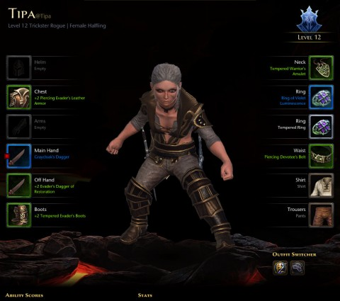
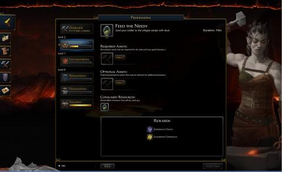
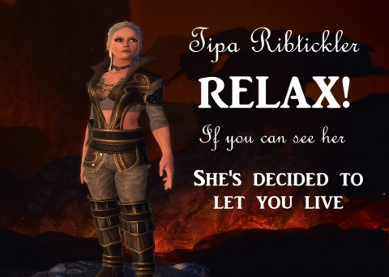

Back to: [West Karana](/posts/westkarana.md) > [2013](/posts/2013/westkarana.md) > [May](./westkarana.md)
# Neverwinter: Gateway

*Posted by Tipa on 2013-05-02 07:07:33*

[caption id="attachment\_10855" align="aligncenter" width="480"] Tipa, Trickster Rogue[/caption]

With the Neverwinter Gateway, Cryptic has improved upon World of Warcraft's Armory. Like the Armory, you can check out a player's gear and stats, but then it takes it another step further.

Correct me if I'm wrong, but does WoW's Armory allow you to do crafting from your web browser? Gateway does. Can Play the auction house? EverQuest II did something like this years ago, but they charged money to access the service, and as a result, almost nobody used it. SOE eventually made it free, but nobody has even thought about it for years and I wonder if it even still exists.

[caption id="attachment\_10856" align="aligncenter" width="480"] Click those cows![/caption]

Folks in my Neverwinter guild (Combat Wombat) are just giddy over the prospect of being able to play some little slice of Neverwinter from work, on their phones, checking in when their timers are up to send their little crafters to their new tasks. The comparisons to Farmville are lost on nobody, but the secret of Farmville was engagement, and keeping people engaged and interested in playing a MMO past the first couple weeks is no small victory.

It hasn't been a couple weeks yet. I'm projecting. How long did people click virtual cows in Farmville before they tired of it? Six months? If Cryptic gets six months from the average player, they can't help but be ecstatic. Six times longer than the average player stays with an MMO. Some will stay for years, some will leave after a day, but the average player playing a new MMO for about a month sounds right to me. Always some new game comes along to lure people away. The Gateway could be a powerful tool to keep people in Neverwinter when Wildstar and The Elder Scrolls Online are released.

[caption id="attachment\_10857" align="aligncenter" width="480"] Tipa Ribtickler[/caption]

Before I tired of repeating the 1-20 content in Neverwinter's numerous betas, I played a Devoted Cleric, a Great Weapon Fighter and a Trickster Rogue to decent (for beta) levels. I never gave Control Wizard much of a chance -- and neither have very many other people, as any casual survey of grouped players shows very few in wizard's robes; there's only one in the entire guild at this time. (Useful nugget found through the Gateway...)

When I was allowed in on the second stage of Neverwinter's tiered launch, I created one each of rogue, fighter and cleric. I thought about which to play for a couple of days while I enjoyed EQ2's double xp weekend and the launch of Scars of the Awakened, then came back to Neverwinter yesterday determined to be a rogue. Cleric would be the easy choice -- nearly unkillable, with the ability to hire a DPS companion at level 16 to handle any shortcomings in that department. Cleric was by far the easiest class of the ones I tried -- powerful solo, and welcome in any group.

The various fighters are allowed to stand toe-to-toe with enemies, allowing the simple sort of play where you wade in to enemies and make those poor villains regret the hour they were hatched. A healer companion at level 16 addresses the one concern with THAT sort of gameplay.

Rogues, though -- can't take a hit, so they must always be moving. Their signature move, stealth, lasts only seconds, and that's how long you have to choose your target and decide upon an attack -- a few seconds of combat advantage in a group of week foes, or leap behind a powerful enemy to hit it with one deadly strike? Trickster rogues are the tactical melee. Leap in, do the AE daze jump, hit for awhile, then shift backwards and pelt the tank mob with daggers as he's winding up his big swing, then back into the fray once more.

LIKING that.

Neverwinter's big flaw so far is its lack of fidelity to the D&D 4e rules. 4e has a perfectly good way of selecting abilities as you level; Neverwinter has done away with that. That was pretty much as close as they came to using any D&D at all, aside from the setting. There's compromises aplenty when taking a game from the tabletop to the computer, I get that.

I did play through a Foundry mission last night -- I Am Slayer, one of their featured Foundry missions which, nonetheless, wasn't eligible for their Foundry mission bonus. It was a decent romp with decent rewards, scaled to level, and makes me excited to get started with one of my own. I have ideas....

## Comments!

**[Genda](http://thegrouchygamer.com)** writes: WoW lets you use the Auction house remotely through the Armory, which is included in the subscription. It's tools are actually a little better than the in-game ones. No crafting though.

---

**Sirhyl** writes: What server are you playing on? I am on Beholder sirhyl@yedo I think.

---

**[Tipa](https://chasingdings.com)** writes: Ah, thanks. Been awhile since I used it. The WoW Armory is really the gold standard of offline gameplay enhancements.

---

**[Tipa](https://chasingdings.com)** writes: Dragon server, Tipa@tipa, though I'm probably going to switch to my warrior. Rogues seem to be in no short supply everywhere.

---

**Sirhyl** writes: I will use my 2nd slot for a cleric on that server, been having fun with a control wizard so far.

---

**[Tipa](https://chasingdings.com)** writes: Clerics are so uber; I really thought they would be the FOTM class.

---

