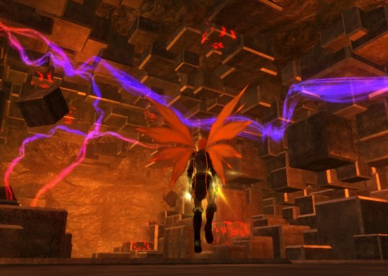

Back to: [West Karana](/posts/westkarana.md) > [2013](/posts/2013/westkarana.md) > [May](./westkarana.md)
# EQ2: Scars of the Awakened, Part 2

*Posted by Tipa on 2013-05-03 07:05:19*

[caption id="attachment\_10860" align="aligncenter" width="480"] Siren's Grotto: Tavalan Abyss[/caption]

Oh, so those mindflayer guys were Tavalan! Gotcha. They were called something different in EverQuest. But every single player knows that those are mind flayers. EverQuest and EverQuest 2 make some really amazing versions of standard D&D monsters, every ability implemented exactly, the art totally spot-on, but then tacks on some random name.

Last night's adventures really showed EQ2's monsters at their finest. I swear I battled an Otyugh at one point.

Last time in EQ2, I was about to build a Force Projector that would invisibly protect the Combine main camp in Cobalt Scar from drake attack. This was soon accomplished, once I found out that the mystery components for the final few combines could be had from random boxes in the camp. I'm ashamed to say I did have to turn to the Internet for help with that one. That done, all made, hailed as the hero of the camp, I delivered the force projector, got my mysterious blue coins as reward and -- and that was it. No drakes came attacking (no drakes had actually ever been seen in the skies), no unique end reward. I've done both the Othmir and Combine tradeskill arcs, now. The Othmir one ends in a huge battle with undead Othmir within the remains of a powerful dragon. The Combine ends with pretending the camp was ever in any danger.

I'd already collected the quests for the daily Siren's Grotto runs. I started off, again, with Alluring Embrace because I'd done that one already and wanted to see how fast I could do it, now that I knew what to do. I want to make another video, but only if it's under ten minutes. Who'd watch something longer than that?

First boss, the bouncy boss: Won't let you just stand under the waterfall to be permanently free from madness. She teleports you away. I did find, after the fight, some entranced Combine soldiers to free for the quest, allaying my fears that I was killing the ones I was supposed to save.

Second boss, the sirens and the elemental. I didn't bother killing the sirens once I'd broken their concentration, but just dragged them to the next one until they were all aggro and the elemental was dismissed. Turns out they bolster each other when close to each other, so this was a strat SOE expected. Still, faster and easier than being beat upon by the elemental all that time.

The sisters and the frog boss were no different -- except I occasionally earned an Obol from bosses instead of coin after I completed the daily quest concerning them. For the Queen, I destroyed the coral barrier as soon as she raised it, making the fight fairly short. Searching the instance for all the Combine warriors that needed saving took up more than ten minutes, but I don't think I'd have come anywhere near that even if I just stuck to the killing.

Exited the instance, turned around and entered Tavalan Abyss. I didn't find this one nearly as easy as Alluring Embrace.

First boss was a mindflayer that summoned floating heads. Being near them too long apparently insta-kills, so I tried staying in motion once those were up and killing them on the run, and that seemed to help. I think this was the one where the boss was going to focus attention on me, and I knew I needed to get going. Took a couple tries.

Second boss encounter were four mindflayers fighting together. One of them -- the one whose name starts with 'F' -- is a healer who heals and rezzes his friends. Once I saw his healing messages in the chat window and knew to kill him first, it was fairly straightforward. I was trying all sorts of things -- trying to kill them all evenly and such -- but it was knowing who the healer was that was key.

Third was a beastmaster, who summoned adds during the fight, including the Otyugh and some other critter; I'll have to remember to take screen shots next time. There was an additional critter that didn't take part in the fight that is doubtless there for the group versions of the instance. Simple fight with no strat needed, aside from killing the adds first.

Fourth was another Queen siren. Aside from clicking on clam shells to stop Epicx4 monsters from entering the room to kill you (you don't have long to do so, so fight near them), nothing really memorable about this fight. There's some harvestable trees in the back that you can get some CoE-ish charms from for quick buffs during the fight.

Fifth was the boss who lives in the trippy room from the top screenie. His trick was summoning a clone who would heal the boss if they were close together. This just required pulling the clone away and killing it separately, since the boss doesn't move when the clone is out. Simple once I figured it out (the game does explain the healing bit).

Loot were a couple 160-ish stat gear, one of which was an upgrade for my Inquisitor. Along with some mysterious blue coins, and an Obol for killing the boss (required by a daily quest).

Obol drop, rarely, from CoE trash mobs, but I haven't gotten even one from all the solo instances I've run, and so don't have even one piece of CoE Obol gear. Siren's Grotto's legacy might be earning me enough Obol to buy good enough gear so I can stop playing a crap-gear berserker and have the gear good enough to tank for a group. I really want to start grouping, but the tank requires an order of magnitude more skill and gear than any other group member. Skill and gear I just don't have.

## Comments!

**Jesse (Bludy)** writes: Ah HA! So EQ2 is where you been hiding! I just recently started playing my little inquisitor again on there. Maybe I'll see you around ;)

-Bludysky

---

**[Tipa](https://chasingdings.com)** writes: Not really sure what I'm doing on EQ2, since I'm not skilled enough or geared enough to group. It's just a comfortable place to be while waiting for EQ Next :)

Nice to see you again! Been awhile!

---

**Zygwen** writes: Otyugh were in Kingdom of Sky.

I think you missed some tradeskill quest at the combine camp. Try going over the ledge towards Siren's Grotto.

---

**[Tipa](https://chasingdings.com)** writes: Got those. Not at the time I posted this, but afterward, when I was wondering what ts quest I'd missed because I wasn't able to buy all the recipes.

---

