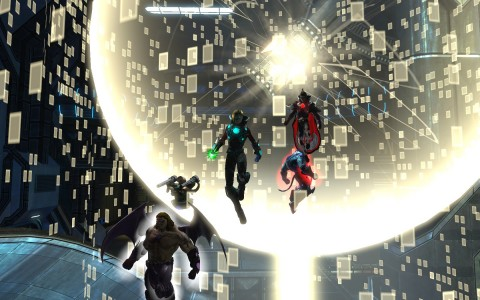
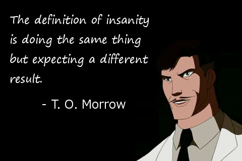
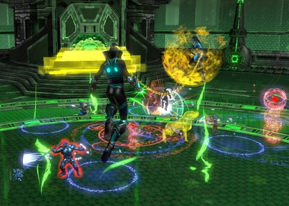

Back to: [West Karana](/posts/westkarana.md) > [2013](/posts/2013/westkarana.md) > [May](./westkarana.md)
# DCUO: The Taking of STAR Labs 123

*Posted by Tipa on 2013-05-06 06:48:51*

[caption id="attachment\_10863" align="aligncenter" width="480"] The Digibit Disco Globe in STAR Labs[/caption]

> "My greatest failure will become my greatest triumph!"
- Dr. Tomek O. Morah, Oolong Island

Those were the wise words of T. O. Morrow, just moments before we finally destroyed his Tornado Tyrant android after weeks of our own failures.

More wise words from Morrow. Ya know, these pictures of famous people, often quoting them saying things they didn't actually say, are such a meme that there's now a *counter*-meme where famous people are apparently saying the most possible wrong thing the artist could think of...

And, BTW, you think Einstein was the actual originator of that quote, [but he wasn't](http://en.wikiquote.org/wiki/Rita_Mae_Brown). Someone back in the 80s gave the quote to Einstein just for fun and now everyone accepts it as gospel.

So, anyway, inspired by the example of our third favorite mad scientist, Team Spode returned to the site of our own greatest failure, the Tier 2 instance STAR Labs Research Facility. We broke our gear to bits way back when we first started in Tier 2 trying to figure out the Scion of Fear, the ~~final~~ penultimate boss of the instance. Since that night, STAR Labs hasn't been the daily double when we've played -- until now, that is. Our greatest failure... was in not even remembering half the battles. We'd forgotten pretty much everything -- but when we got to the bouncy toxic tree forest of flaming death, there was an "A-HA!" moment in all our heads. We remembered.

We're a lot more powerful than we were back then, and we killed the Scion of Fear with ease.

[caption width="470" align="aligncenter"] Scion of Fear[/caption]

Even got an achievement for killing him in less than five minutes. BUT! THAT WAS NOT THE END OF THE INSTANCE! We just all floated in the air for a couple of minutes, expecting some sort of ending cinematic. Glowing yellow arrows, though, led us to our next goal, bringing little glowy energy balls from one place to another in the facility, causing Parallax to be driven from the huge yellow lantern in the lab foyer and possess Arkillo, Kilowog, Sinestro and Hal Jordan in turn. We killed them all. Can't believe it took Ryan Reynolds like two hours to defeat Parallax in his [movie](http://greenlanternmovie.warnerbros.com/).

[caption id="attachment\_10866" align="aligncenter" width="480"] It was an open-and-shut case[/caption]

We still had plenty of time in the night, so we opted for the Oan Sciencells again. You stand in one spot, mobs rush you, you kill them. Collect free loot. Easy-peasy.

Krona, the RENEGADE GUARDIAN (as we now all know), still was dangerous enough to give us a little bit of trouble. It wasn't really dodging the death beam, so much, as it was all the stupid adds preventing us from dodging the death beam. It took a couple tries, but we succeeded in the end. Looking back on it, I think we succeeded best when we just used Krona's powerful display of [Schwartz](http://en.wikipedia.org/wiki/Spaceballs) as a time to really, really hurt him at the one time he could not fight back.

And then we were done for the night. Kaptain KY got a couple upgrades, bringing him to CR 52, just one shy of T3. Though I didn't find any upgrades, SOE had decided for some reason to bump my CR from 52 to 53, opening the Tier 3 open zone, Center City, home of the Flash. Brainiac hasn't started bottling Center City as he has done with Gotham City, and super-powered fighting hasn't destroyed the heart city as in Metropolis. In Center City, the Speed Force has come unsprung, infecting the citizenry with super speed before it eventually kills them. Center City sells Tier 2.5 gear, providing the first purchasable upgrades for the mask, ring and neck slots. I bought a new ring from a street vendor and my CR was bumped to 54. I'm hoping that puts me above the T3 threshhold, even if SOE should drop me down a CR again.

Spode took me through the daily catching speedsters quest for some easy marks. Spode and Stingite have already moved beyond the 2.5 gear, and are earning and saving the thousands of marks necessary for T3 gear. I think I'll see how we do on the T3 instances before I worry about T3 gear.

If Kaptain KY gets another upgrade before next week, we may be starting on T3 group instances, a major milestone. If not, it could be a couple weeks. No hurry. We're making pretty good progress for playing just once a week.

