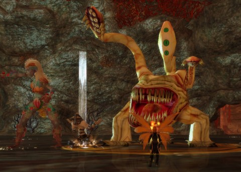

Back to: [West Karana](/posts/westkarana.md) > [2013](/posts/2013/westkarana.md) > [May](./westkarana.md)
# EQ2: Scars of the Awakened, Part 3

*Posted by Tipa on 2013-05-07 06:16:33*

[caption id="attachment\_10873" align="aligncenter" width="480"] Taking on an Otyugh[/caption]

Over on Neverwinter, they're spotlighting the various D&D critters who have made their way into that D&D-based game. But, EverQuest 2 is no slouch in the classic monster imagining, either -- rust monsters and displacer beasts just two examples, and then there's this Otyugh as one of the minions of Kira the Beastmaster in the Tavalan Abyss. It was awesome to finally see this beast in the flesh, and then to kill it.

I hadn't realized that Cobalt Scar is a "phased" zone until I was wandering along the Combine camp, checking out the ballistas, and heard sounds of pitched battle from nearby, fighting mobs I had seen nowhere in the zone. Everything LOOKED calm and peaceful, so where was this fighting coming from?

It was coming from a phase I could not see. I thought I was done with the zone except for a "heal the poisoned otters" quest, but clearly there was more to see. Probably the tradeskill quests that arm the camp against an imminent attack would have made more sense if I'd had the correct adventure quests done so that the camp would be actually about to be attacked.

Healing those Othmir was not easy; some would arrive on the mats nearly dead while I was trying to keep another alive, but after a few tries, I managed to let only three die. This opened up a new series of quests which lead back through the Othmir camps in the Great Divide and the Eastern Wastes, and then to the undead Othmir camp in Cobalt Scar. While exploring the zone, I'd come across the camp and had done the tradeskill quests available there, apparently out of order, as now I had the dove-tailed adventuring quests open. There was a nice trip into the past to see the downfall of the original Othmir, then back to the present to undo the fell enchantments.

This opened up the Kelethin Outrider camp, which, until now, had been an area of abandoned tents and such. Aha -- I'm into the next phase.

The quest gear appears to be slowly giving me armor like the Combine soldiers in the main camp, as well as some white seashell armor from the Othmir. I didn't realize this at first, and transmuted some of it. I really prefer the DCUO method, where once you get some gear with an appearance, you can use that appearance forever after, even if you get rid of the gear.

With the Obols from the Siren's Grotto instances, I was able to purchase my first piece of CoE group gear, the chestplate. They also take Greater Spirits, of which I had only one. These drop from group instances, and groups really have no place for a crap-geared berserker, so probably out of luck getting more of those.

Now it's time to save these Kelethin outriders and head up to finally, maybe, see drakes attack the main camp!

