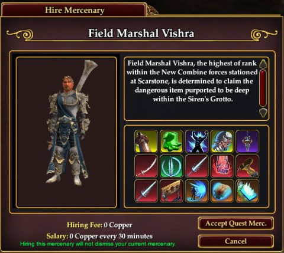
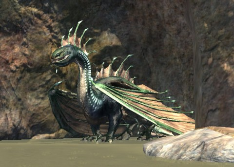
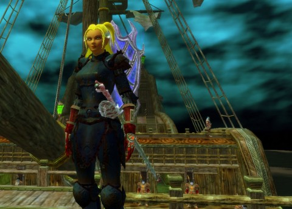
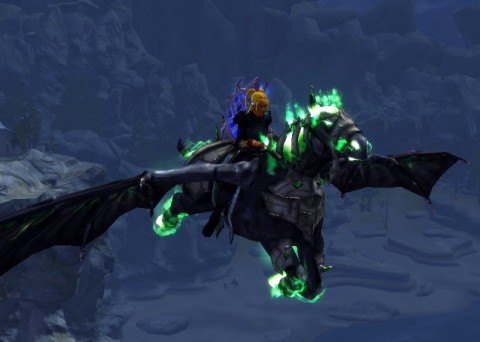
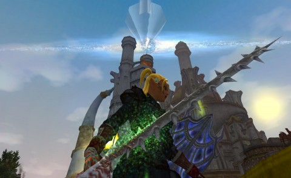

Back to: [West Karana](/posts/westkarana.md) > [2013](/posts/2013/westkarana.md) > [May](./westkarana.md)
# EQ2: Scars of the Awakened: Part 4, The Completening

*Posted by Tipa on 2013-05-12 12:25:29*

[caption id="attachment\_10881" align="aligncenter" width="480"] The Field Marshal and I go a-hunting[/caption]

I really have finished the Scars of the Awakened storyline, all the tradeskill quests, all the adventure quests, gotten the titles, loot and achievements and picked up a couple upgrades from my innumerable trips through the Siren's Grotto solo adventures. I'm going to try and describe the zone's story, as I've come to understand it.

Velious was the place where the planet-sized mother of all dragons, Veeshan, clawed Norrath to claim it as her own. The Great Divide, Wakening Lands and Cobalt Scar were all wounds left by her monstrous claws. She left her draconic brood to grow and thrive on Norrath and then went to the Plane of Sky where, after many centuries, her long-imprisoned descendant Kerafrym the Sleeper, found her, killed her, and started his war against the dragon faithful that united the warring Claws of Veeshan (CoV) and the Ring of Scale (RoS) against the Sleeper's faction, the Awakened.

In EverQuest 2's timeline, the Awakened have recently rampaged through the CoV city of Skyshrine. Skyshrine's king, Yelinak, has fled and claimed sanctuary in the dwarf city of Thurgadin. Having left Awakened forces behind to hold Skyshrine, the dragon rebels moved on to Cobalt Scar, the source of an immense, evil draconic force.

The Combine empire, forced back to Norrath from their home on Luclin after Kerafrym destroyed that moon in his rage, has forged a path through Velious from the Great Divide through the Withering Lands and over the protected sides of the immense plateau that the CoV dragons made of Skyshrine and its surroundings to save them from the Awakened (a trick that didn't work at all, clearly). With the path open, the Combine forces discover that their worst fears were realized; Kerafrym is establishing a beachhead on the Skyshrine plateau from which to conquer the lower world. The Othmir who were stranded in Velious when the plateau was raised entered Cobalt Scar with the Combine, but ran off to find their long-lost brethren without waiting for the Combine to clear the way, and have not been heard from since.

That's where we players come in.

[caption id="attachment\_10883" align="aligncenter" width="480"] Kelorek'Dar[/caption]

**The Awakened Forces**

The Awakened are based in the Drakelands in the west of Cobalt Scar. They are led by Kelorek'Dar, an epicx2 whose position is marked in the tactical map the Grand Marshall is examining in the main Combine camp at Scarstone. (It was by looking at the map that I knew where to find the drake lord). SOE loves anagrams, and Kelorek'Dar's name re-arranges to Drake --- something. Klore? I dunno. They need to wipe out the Combine forces in order to continue their assault on Norrath.

**The Fina's Retreat Othmir**

Most of the Othmir that accompanied the Combine forces from the Great Divide are stranded on a large rock down toward the beach from the Combine supply camp. They are penned in on all sides by the walrus-like Ulthork, some of whom are insane, and all of which are hostile. The players here will fight the Ulthork and help Osh, the Othmir Speaker, connect with their god, Prexus, the god's avatar, Lodizal, and with the Othmir left behind in Great Divide and the Eastern Wastes.

**The Undead Othmir Camp**

The remaining Great Divide Othmir continued searching for their lost cousins, and found they had all been killed and re-animated as undead. With the help of Osh, the player will discover the ancient evil that lies beneath Cobalt Scar. It is the evil of a powerful, long-dead dragon (that doesn't correspond to any EQ1 dragon that I remember; the one dragon in Cobalt Scar, way back when, was a water dragon). When disturbed by an inquisitive Othmir High Shaman of old, its evil power killed the all the Othmirs and re-animated them as undead. The player will put the spirit back to rest, but its evil influence will continue to be felt for years.

**The Supply Camp**

This is the first outpost of the Combine Empire in Cobalt Scar, and is where players will enter the zone until they unlock the travel point in Scarstone. They are in occasional communication with Scarstone, but have lost contact with a camp of Outriders who had opened a path through the forest maze to allow travel between the camp and Scarstone.

**The Kelethin Outrider Camp**

It's not clear what happened to the Kelethin Outriders, who apparently were taken from the camp without fight or struggle. The quests I did leave the question up in the air, but hint that the forest itself rose up one night and took them, [Huorn](http://en.wikipedia.org/wiki/Huorn)-like, to their dooms. The forest spirits and other, normally benevolent, forest entities are violently enraged and have risen up against Scarstone, though this may be because the forest has been partially cleared to build the Scarstone camp. Scarstone is protected against the forest, but the Kelethin Outriders were not able to place their wards in time to prevent their own destruction.

**Scarstone**

The main Combine Empire camp, the focus of the defense against the drakes, and the direct entrypoint to Cobalt Scar, once unlocked via the adventuring or crafting timelines. Both timelines deal largely with fortifying the camp against drake attack and making sorties into the Drakelands. However, they still have questions about the rise of the undead on the eastern and northern shores, and the mysterious sirens to the northwest.

**Howler's Cove**

These undead are the risen remains of sailors whose ships were called to smash themselves on the shoals and reefs by the Darkwater Sirens. They have been re-animated by an evil power emanating from Siren's Grove.

[caption id="attachment\_10882" align="aligncenter" width="480"] Fighting mindflayers in the Tavalan Abyss[/caption]

**Siren's Grotto**

Initially asking for help from the Combine forces to save them from the undead, the player finds within the Alluring Embrace instance that the sirens have been capturing and enslaving Combine soldiers. It's possible but unlikely that the sirens were responsible for the abduction of the Kelethin Outriders, as the ones you can save say they are from the main camp. When the queen of the sirens is defeated, she calls upon the Tavalan mindflayers to grant her sanctuary as she escapes to their lair in the Tavalan Abyss.

If you follow her through the portal to the depths of Darkhollow, you'll eventually find the Queen in her sanctuary. Defeating her lets you confront the Lord of the Tavalan, whose power of fear and mind-control had corrupted the siren queen.

The adventure timeline ends with you and Field Marshall Vishra entering a special version of the Tavalan Abyss, the Tear in the Grotto, to discover that the source of the queen's power was a fragment of the necrotic dragonbone that had killed and corrupted the Othmir and raised the undead in Howling Cove.

[caption id="attachment\_10880" align="aligncenter" width="480"] Scatterfall the Not-a-Fae[/caption]

That's my understanding of the plot behind the new Game Update. This would have been a really slick Adventure Pack back in the day, but now it's just a free update. The amount of new lore is amazing; it advances the Velious storyline and sets up more stories (a return to the Undershore, maybe?). There are all-new armor sets with new looks and equivalent to the Chains of Eternity sets, the solo zones are first rate, and I look forward to someday seeing the group versions of those zones.

Careful readers of this blog may remember Scatter as a Fae. Well, one day, call it Saturday, I was waiting for my timer to expire so I could re-run the Daily Dreadcutter, and noticed that with the Blessing of Xegony flight power running, my character was being dwarfed... BY A DWARF. Every time I do get into a group, it's hard for people to keep track of where I am because, too small. Frustrating, especially if you're a tank.

I looked through my illusion collection and found a wood elf illusion. I dropped my Fae flight power, cast the illusion, and summoned the mount I got from spending the Dungeon Maker marks back when I was powerleveling myself in those, back when that was something you could do.

[caption id="attachment\_10884" align="aligncenter" width="480"] The Once and Future Fae[/caption]

I actually really like the look. Probably not quite enough to pay real money to make it permanent, but there's something to be said for looking normal once in awhile. I bought some raid boots, and when I ported in to collect them, I was happy to look like a proper tank, with glowing shield and a very cool sword I got from the Tavalan lord, a look sure to inspire any group that would take me as their defender.

I haven't been sword-and-board with Scatterfall for ages, preferring the slow but astonishingly damaging swings of a greatsword. But, until I can pair my new sword... sec, lemme drop a better picture of it... it's so swordfishy, the folks in the auction channel wanted to buy it from me....

[caption id="attachment\_10885" align="aligncenter" width="480"] Swordfish: The Movie: The Game[/caption]

Anyway, until I can pair my new sword with a comparable sword, I'm using a weighted cazicite shield with the appearance of an aetherplate shield from the CoE timeline. This allows me to use a power from the shield AA line to improve hate and just make me more tank-y. In my Daily Dreadcutter runs, instead of being able to slice down the nameds before I kill the adds (and go dragging them with me), I kill more slowly and the adds are typically dead by the time the nameds are. On the other hand, I take so much less damage that my death prevention trigger spells don't even fire.

All this is getting me closer and closer to being able to tank for a group. Inching up on 60K health unbuffed, my haste is near the 400 target, and my multi-attack near the 600 target, so getting close. Granted, these are the targets for a melee dps, but I don't know what the target stats are for a tank yet. Probably should be working on hate and block. But, I do end up soloing 99.9% of the time. And my zerker AAs give me huge boosts to hate and block as it is.

These are the uncertainties that keep me from grouping :P

## Comments!

**Zygwen** writes: I think they did a good job with Undead Othmir pathing. They behave a lot more like zombies than previous zombies did.

---

**[Tipa](https://chasingdings.com)** writes: They have that slow, steady shamble down pat :) I really liked the storyline for Scars of the Awakened. I understand the group instances were kinda broken, but I have enjoyed the AS versions.

---

