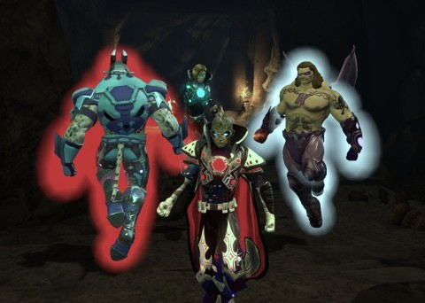
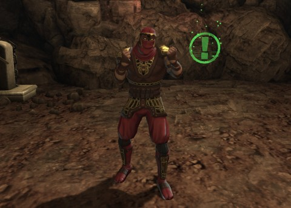
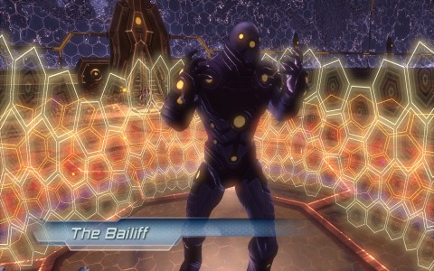
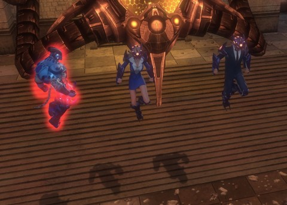

Back to: [West Karana](/posts/westkarana.md) > [2013](/posts/2013/westkarana.md) > [May](./westkarana.md)
# DCUO: League of Assassins Stronghold

*Posted by Tipa on 2013-05-13 05:56:28*

[caption id="attachment\_10889" align="aligncenter" width="480"] Kaptain KY shows off his jerkin[/caption]

That pun wasn't mine....

Anyway. Since both the good Kaptain and I had both squeezed into Tier 3 over the past week, we spent the first half hour or so of our DCUO night enjoying all The Flash's home town, Center City, had to offer a collection of tired but scrappy group of superheroes from the mean streets of Gotham City. We took down a bunch of Paradox Reapers, strange creatures from the nooks and crannies of Time, and then their boss. No screenshots! Argh.

Once everyone had their connection problems dealt with, it was off to our first Tier 3 group alert. The daily double was the League of Assassins Stronghold. How hard could it be?

The League of Assassins is led by the evil Ra's al Ghul, a near-immortal super villain who uses the power of the rejuvenating Lazarus Pits to... just be evil, I guess. Our job: go to the source of al Ghul's power, the Lazarus Pits themselves, fight our way through his assassins, and kill the unkillable.

[caption id="attachment\_10891" align="aligncenter" width="480"] Do not get between Team Spode and a greenie...[/caption]

Aaaaaand that's what we did. A couple of the encounters initially took us by surprise, but we'd figure them out and win the next time. Tier 3? Tier 3 ain't nothing. We killed R'as al Ghul, he regenerated and lost his shirt in the Lazarus Pits, we killed him again. Got some ungodly number of marks from it, too, enough for me to get two pieces of Tier 2.5 gear from the street vendor in Center City, bringing my Combat Rating to 56, I think.

Even given the half hour we spent doing quests in Center City, we ended the Stronghold with forty five minutes left. We decided to have a go at another Tier 3, South Gotham Courthouse.

[caption id="attachment\_10892" align="aligncenter" width="480"] The Bailiff[/caption]

South Gotham Courthouse has been bottled by Brainiac and is in the process of being digitized. Our job is to take Gotham back, one building at a time, and so we've managed, somehow, to attach a staging platform to the side of the bottle and get heroes inside it somehow. Graviton generators inside the bottle prevent the use of super travel powers, so we were stuck walking everywhere.

After disabling the digitizers who were subsuming the humans caught in the bubble, the Brainiac-ized court officials decided to put humanity on trial, just for us. Starting with jury selection. Brainiac robots would try to fill the jury box with robots, while we would try to fill it with humans. We eventually figured out that most of the team needed to hang near the jury box and stop Brainiac robots while someone found human jurors and carried them back.

Oracle managed to get a comm line in and directed us to the graviton generators. We had to use jump fields, conveniently positioned right beneath them, to get up to the generators, defeat the guardians, and shut them down. Hey, I remember this fight from EQ2.... anyway. Once that was done, we could fly again. YAY FLYING.

[caption id="attachment\_10893" align="aligncenter" width="480"] The Prosecutor and Defending Attorney[/caption]

We then faced the Prosecutor and the Defending Attorney. You'd think ONE of those two would be HELPING us, but it seemed the court was stacked against us, and the court was about as impartial as Gordon Ramsey on Pasta Night. The trick is to keep the jurors disabled (where are the human jurors? No idea) while destroying evidence and killing witnesses to keep the lawyers from making their case and enabling them to be attacked.

We died, and died and died and died and eventually just ran out of time. It's looking, though, like we'll just have to keep the group split, again, and have someone killing the couriers and witnesses while the main group keeps the jurors down and kills the lawyers when they are killable. Seems like it could be a long fight -- and there's a boss still to come after these, the Supreme Justice that we can see at the very top of the courthouse.

Sad bit is, even when we do beat this mission, the courthouse will probably still be bottled.
## Comments!

**[Tipa](https://chasingdings.com)** writes: Thing that really gets me about Tier 3 is that the heroes don't even bother showing up to take credit anymore.

Batman: "Bottled courthouse? The only bottle I'm caring about right now is this bottle of Jack right here."

---

