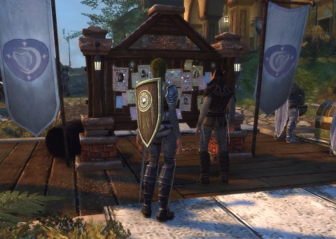
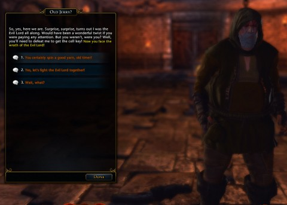
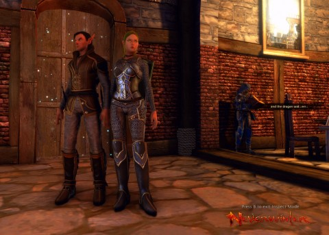

Back to: [West Karana](/posts/westkarana.md) > [2013](/posts/2013/westkarana.md) > [May](./westkarana.md)
# Neverwinter: I just met you, and this is crazy...

*Posted by Tipa on 2013-05-14 06:04:25*

[caption id="attachment\_10896" align="aligncenter" width="480"] Nina and Kasul at the Job Board[/caption]

This is a Neverwinter experiment, and it could be one that has never before been attempted. We don't even know if the game supports this style of play, but what if... what if two or more characters always grouped, and never soloed, through the PvE content of the game?

Most of the content in the game is designed to be completed either solo, or solo with a companion. Two characters (and, eventually, two characters and their companions) would necessarily make that sort of content even more trivial. But two characters aren't enough to do the actual group content. Even if it were possible to run the dungeons and skirmishes as a duo, leveling up entirely by repeating the same dungeons and skirmishes until the next were unlocked would be a pretty dull way of playing the game.

However, there's one kind of Neverwinter content that scales to player level and can be designed to support duos and other unusual playing choices -- Foundry missions.

[caption id="attachment\_10897" align="aligncenter" width="480"] Old Jerry?[/caption]

(The above is a screenshot from the first Old Jerry Foundry mission, which assumes nobody reads NPC dialog).

Kasul of [Shattered Blog](http://shatteredblog.wordpress.com/) (hey, what's the update on Nethack?) decided to take a break from EverQuest and give Neverwinter a try. We thought it would be fun to try grouping in a game that does not promote that style of play. I deleted my halfling Great Weapon fighter and rerolled her as a half-elf Guardian fighter, and Kasul rolled an elf Trickster rogue. We figured that would be a decent combo -- the fighter takes the aggro, the rogue, with combat advantage, does devastating damage. Heals will be the job of the eventual companions.

The solo quests and instances go incredibly fast with two players. The uber sword and purple striker wolf companion I got from the Founders box doesn't hurt things, either. We queued up for the game's actual group content as soon as we could; we've done Blacklake Skirmish several times.

But the best of it all has been the Foundry missions. Our first was one specifically designed for two characters. Someone had designed a bar filled with members of his guild, who came under sudden pirate and demon attack. Our job: save them.

This guy's guild is filled with super people, but they can't fight worth a darn. If my guild had to be saved from complete devastation by two low level adventurers, well, I'd have to have a talk with my recruiting officer.

There were a lot of really decent fights in that mission, though. It's fun to see how people build out their dungeons. Some are utilitarian affairs with no flair; some are filled with extra bits and pieces, like the one we did last night -- clearing the Nasher Sewers of the Master and his undead legions -- which included special accolades for leaving the glowing path and going exploring.

[caption id="attachment\_10898" align="aligncenter" width="480"] 1.49999 elves walk into a bar...[/caption]

We're only meeting once a week, so it's going to be a couple of weeks before we hit the Cloak Tower, the first actual dungeon. We'll be forced to move through it super-fast, because that's how random groups move -- Neverwinter will have trained everyone, by then, how NOT to work within a group.

Not us; we'll know.

## Comments!

**[Asmiroth](http://www.marcleoseguin.com)** writes: I'm not 60 yet but once you hit level 30 the game starts to transform. Companions becopme weaker (the cleric spends more time dead than alive) and all group content starts requiring thoughtful action to complete. It's broken in some places, sure, but the net effect is that you need to pay attention or you're going to die. It's common for me to have a member just droup after a death. As if NW was 2 different games.

---

**[Tipa](https://chasingdings.com)** writes: I just hit 31 on my main, and the Helm's Deep skirmish and whichever dungeon it is we're doing, both are significantly harder than what came before, for sure. I'm still in the Neverwinter Graveyard for the solo quests, and I'm still doing okay without a healer companion (I use a tank companion for combat advantage). But, he is tending to die more easily these days... I'm pretty sure the Perfect World-approved solution, though, is to buy a meatier companion.

---

**[pkudude99](http://nomadicgamers.com)** writes: My latest thoughts on NW are [here](http://nomadicgamers.com/2013/05/13/quoth-the-raven-nevermore-or-neverwinter-whatever/).

TL;DR version is: Don't really know why since I've not really cared for the action-combat style before, but NW is "doing it" for me. I like the Control Wizard and the Trickster Rogue the best, the Cleric is fine, but more or less "just there" for me, and the Guardian Fighter surprised me with how much I began to enjoy it after level 10 and gaining the ability to taunt/attack while blocking.

***

I've done a few duos with friends here and there, and yeah, it goes WAY faster and easier. Haven't done any Foundry missions designed for duo's yet, but am looking forward to being able to do that soon. As it is, I'm finding that I generally prefer the Foundry missions to the dev-created missions anymore. 

I have had to tell people in groups to quit mindlessly following the glowing paths in the dungeons, as they're missing bonus goodies by doing so. Cloak Tower gives you 2 bonus chests at the end if you pick up items that are slightly off the main path, you can miss a boss and its drop if you only follow the path, plus 2 chests along the way can or will also be missed if you simply follow the sparkles. IOW -- explore the damn dungeon people!

---

**tribles and bits** writes: Tipa, love your blog. Any chance we'll see you return to STO to roll a Romulan?

---

**Zygwen** writes: I queued up for a dungeon once and everyone but my Rogue and another Rogue left the party. We decided to tough it out and managed to clear everything but the last boss. Took a lot longer than usual, that dungeon just kept going for ever but it felt more real toughing it out. If we had a different duo maybe we could have finished the last mob too. As it was, we got it down to 50% with me kiting the boss most of the time. Do any modern MMOs still allow kiting?

---

**[Tipa](https://chasingdings.com)** writes: @tribles, you know it! I've been dying to play a Romulan since I first touched the game. I've been following along on beta reports from my friends, and I have the feeling Cryptic will be getting some cash from me for some of those ships....

---

**[Tipa](https://chasingdings.com)** writes: @pkudude99 -- I've heard people go back and grab the chests and bosses people missed in the Cloak Tower and the spider boss in the next one (three chests in that room!) after the rest of the group is gone. So yeah, I'm thinking I won't care so much if people run ahead; I'll just come back later.

That sparkles thing is useful, too useful. When I enter a room now, I look first in the direction the sparkle is NOT going. Usually something worth seeing there.

---

**mutahx** writes: @Asmiroth The cleric gets weaker past lvl 30 because she is a 'white' companion and they can go just up to lvl 15 (equivalent of a lvl 30 player). 'Green' companions go up to lvl 20, 'Blue' up to 25 and 'Purple' up to 30. There are Tomes coming that will allow you to upgrade 'White' companions to green, blue and purple. Otherwise look for a green or blue companion in the AH

---

**[Tipa](https://chasingdings.com)** writes: If you do the "invocation" for 350 days, you can buy a purple angel healer companion.... Just checked. You use the Ardent coins of which you get one per day.

---

**[Neverwinter Beta Gameplay Episode 05 (Lair of the Mad Dragon) | EssayBoard](http://essayboard.com/2013/05/17/neverwinter-beta-gameplay-episode-05-lair-of-the-mad-dragon/)** writes: [...] Neverwinter: I just met you, and this is crazy… (westkarana.com) [...]

---

