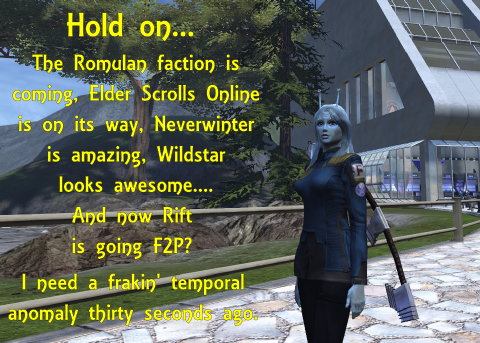

Back to: [West Karana](/posts/westkarana.md) > [2013](/posts/2013/westkarana.md) > [May](./westkarana.md)
# STO: Where's my TIMESHIP?

*Posted by Tipa on 2013-05-15 06:42:20*

[caption id="attachment\_10902" align="aligncenter" width="480"] Computer, freeze simulation Tipa alpha six[/caption]

Sooooooo I log into Star Trek Online after being away for several months. With the Romulans coming, I'd better get familiar with the game again, right? My monthly stipend of Zen (cash shop currency) for being a subscriber has built up enough that I could get the three-pack of Andorian escort ships I've been wanting since pretty much Day One for free. Free in a sense, given I've been subscribing to a game that I haven't been actively playing. But, I wouldn't be out any \_additional\_ cash.

But... Romulans as a playable faction are something I've been wanting ever since I maxed out Tipa D'zoph's level, but with that not available, played through the Klingon storyline with my sexy old school Klingon captain.

Now, though, they're on their way! And with a whole bunch of new ships!

Problem is... I can only play two MMOs at once, and that is one more than I probably SHOULD play. Before Neverwinter, it was EQ2 and DC Universe Online. When Neverwinter launched, DCUO dropped to our Sunday night game. I am really hoping that The Elder Scrolls Online and Wildstar would be considerate and space themselves out enough so I could finish Neverwinter before moving to one of those two.....

.... And then yesterday's bombshell: Rift, my most recent "Play just one MMO, for a year" experiment, has gone F2P. I'd dropped the game when I'd finished all the group content at the time and had found, again, that the raiding lifestyle is not something I can deal with any longer. They've added a whole lot of new content since then, but once gone, it's not easy to return, especially since I'd be pulling out the checkbook to even check out the new stuff.

In June, that won't be an excuse.

I just have no idea, whatsoever, where I'm supposed to get the time to return to the game. But, it's definitely worth checking out once more.

