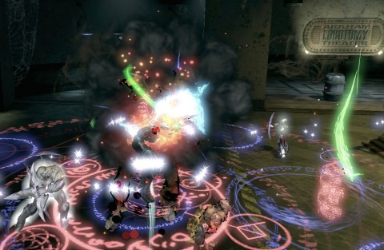

Back to: [West Karana](/posts/westkarana.md) > [2013](/posts/2013/westkarana.md) > [May](./westkarana.md)
# DCUO: The inmates are running the asylum?

*Posted by Tipa on 2013-05-21 06:01:33*

[caption id="attachment\_10905" align="aligncenter" width="480"] Arkham Asylum[/caption]

Before we get started, I want to draw your attention to the right bit of the screenshot above. Where we see the entrance to the Arkham Lobotomy Theater. With marquee lights to attract passers-by. They sell snacks and Soder Cola at the door, and tradition has it that you're supposed to hurl popcorn at the doctors when they make poor incisions.

Commissioner Gordon had sent us to the asylum because, apparently, three of its most notorious residents -- Drs Pamela Isley, Victor Fries and Jonathan Crane -- AKA Poison Ivy, Mister Freeze and The Scarecrow -- have not only escaped, but turned the three wings of the Asylum into their own private playgrounds. Lore scattered through the place implies that their common attending physician had been driven crazy by the three and mysteriously disappeared after giving them their freedom.

Number One: If you're a scientist or a doctor in Gotham City, you're probably going to go insane and start killing people.

Number Two: No matter how many people you kill in your mad rampages, the full resources of the city will be given over to see that you get the care you need so that you can be, someday, set free to kill again.

Number Three: Gotham City provides little to no oversight over the incarceration of the people who have brought murder and terror to the city.

Number Four: Naming your hospitals after places from Lovecraft's Cthulhu mythos is somehow a reasonable idea.

This Tier 3 instance opens with the super villains having taken over Arkham Asylum. Commissioner Gordon sends a team in there to restore order; they are not heard from again. He calls upon Batman and Robin; Batman is captured and not heard from again. Robin just sits, lonely and confused, in the lobby, waiting for ~~Dad~~ Batman to come pick him up. Gotham's Finest have failed their city. Time for Team Spode to take the lead.

The Scarecrow taunted us throughout his wing of the hospital as we murdered his minions and freed staff and constables. The fight was familiar from the T2 solo instance. It's only been a couple of days, but I don't remember anything special about it.

Mister Freeze was a little deadlier; his minions tended to mob us. During his final fight, we had to remember to bring mobs, and the good doctor himself, near to the open boilers to weaken them, but we didn't have any real issues with the fight.

Poison Ivy also was familiar from her T2 solo instance. There were some close moments, but we were never in danger of a wipe in any of the three wings.

In the night's least surprising twist, the three villains fled to the lobby to await us together. I'm not sure if we were required to kill them in a specific order or it just happened that way; it seemed to me that only one took damage at a time. Whichever. It was a fairly long instance, and we didn't have a chance to do another T3 that night, so we had to just accept the thanks of a grateful Commissioner and a useless Boy Wonder and call it a night.

Teal Lantern was able to get another piece of Tier 2.5 gear with the marks earned from the instance and some Center City dailies, but she's still stuck at CR 56. Lord Spode and Stingheal are sitting at around CR 70, and are likely the reason the instance seemed easier than expected. Kaptain KY's CR is probably near Teal Lantern's.
