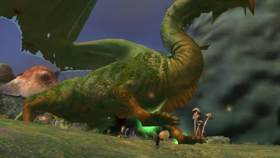
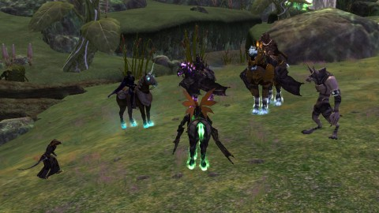
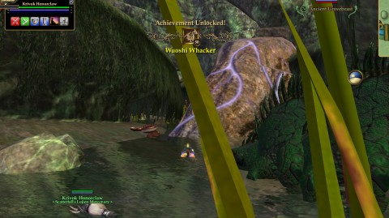

Back to: [West Karana](/posts/westkarana.md) > [2013](/posts/2013/westkarana.md) > [May](./westkarana.md)
# EQ2: Wuoshi Must Die

*Posted by Tipa on 2013-05-23 06:34:01*

[caption id="attachment\_10915" align="aligncenter" width="480"] Can you find the tank in this picture?[/caption]

The real slap in the face came when I won a Fae Wing Cloak. How is this even a THING? I suppose I should weep for all my unwinged brothers and sisters who now have to walk on unfamiliar ground because their wings have been turned into outerwear, but for me, a Fae, to wear one... that's like wearing human leather boots with babyskin gloves.

Afterward, I respectfully declined lottoing any other Fae Wing Cloaks.

We were in the Emerald Halls for several reasons. First, to pick up a unique appearance weapon for Hamal. Second, for the nostalgic fun of duoing an annoying raid that used to take several nights, back in the day. And third, because Wuoshi just really, really wanted to die. 

I'd forgotten everything I ever knew about the raid; even which guild I was in when we did this raid. (A look through the archives of this blog reveals our first kill was in December of 2007, and the guild was Eternal Chaos on the Befallen server). A lot of the mobs in Emerald Halls stun, leading to a few fights were we could only watch helplessly as our hit points dropped to zero. We broke off the first night after making little headway against the Farstrider Unicorn, whose adds kept us helpless.

Throughout the next day we texted strat ideas back and forth, got back in game and Hamal offtanked the stun adds while I whittled down the unicorn. Things broke free toward the end, but we managed to get the win and to go on to finish clearing the second floor.

[caption id="attachment\_10916" align="aligncenter" width="480"] Wolves and Debauchery[/caption]

Third day was the third floor, and we got a little help from members of the Debauchery guild, whom I'd just helped click statues for the Assassin epic. We all chrono'd down to level 80 and headed in to kill the dragon.

But first, we'd have to clear the level of everything EXCEPT the dragon, without aggroing the dragon. We'd already lost the chance to clear out some of the lesser trash by not having a mage to accept the challenge fight at the beginning of the level. We hadn't had a player priest for the first level; Hamal easily won the scout challenge for the second level, but the problem with duoing raids is, when a specific class is needed, probably that's not going to happen.

After a couple of accidental aggroing of Wuoshi that summoned every mob on the third floor to kill us, we became VERY paranoid and respectful of the creature. And oh my god, there's a bunch of trash up there. I remembered why nobody liked this raid very much.

When we'd killed every other mob, we pulled Wuoshi to the island in the middle of the zone. I vaguely remembered us kiting her around that central pillar. And when she popped two adds, I vaguely also remembered that we used to offtank those somewhere far away while the rest of the raid killed the dragon. When I got teleported into a river, I had nothing. I didn't remember that at all. But I was a troubadour then, and my actual connection with raid mechanics was minimal at best. I was there to make mages look good and that was pretty much that.

I had solid aggro, though, thanks to some recent shuffling around of abilities such that the super aggro ability, Adrenaline, was way more available. With that running, it is impossible for any non-fighter to pull aggro from something I want paying attention to me.

[caption id="attachment\_10917" align="aligncenter" width="480"] Wuoshi Whacker![/caption]

We were all pretty pumped about the kill. Raiding this old stuff is FUN. No longer require a full raid, there's not the endless cycle of death and discovery that comes with doing raids at level, it's raiding with all the frustrating bits removed. I know there's people out there who could solo the zone in three pulls, fifteen minutes tops, but speed and loot was never the real goal here.

It was always and ever about having fun with friends -- that's the hidden heart to any MMO. Grouping up with friends and going off to kill a dragon is what keeps me logging in, running solo instances again and again so that I am geared well enough to be the tank for whatever anyone chooses to do.

Now that we have a group, we can do a lot of the old school stuff that it's impossible to do these days. Finish my Soulfire quest. Kill Trakanon. Hamal mentioned the Djinn Master. Soloing these things is pointless, but chrono-ing down, grouping up, working on strat and moving in for the kill -- this is the stuff from which stories and memories are made.

Sure, I'd love to work on current content, too. Who knows? That could be a thing that happens someday.
