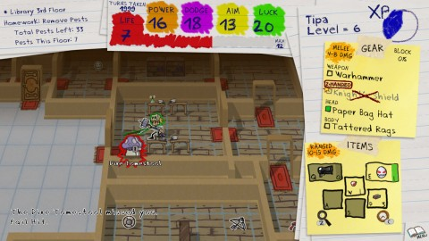
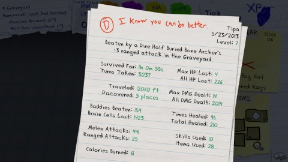

Back to: [West Karana](/posts/westkarana.md) > [2013](/posts/2013/westkarana.md) > [May](./westkarana.md)
# Crayon Chronicles: A Roguelike for your Inner Second Grader

*Posted by Tipa on 2013-05-24 07:10:04*

[caption id="attachment\_10921" align="aligncenter" width="480"] Crayon Chronicles[/caption]

I should have called this "A Child's First Roguelike". Or, "How to get through school with only an Owl on a Stick". Whatever. Outer Grid Games' "[Crayon Chronicles](http://www.outergridgames.com/)" is a short, sweet RPG that combines a whimsical art style with easy gameplay and a few chuckles to make the best roguelike I've played all year.

[Roguelikes](http://en.wikipedia.org/wiki/Roguelike) are games based off the old mainframe RPG Rogue. Games of this sort share some tropes; randomly generated levels, turn-based gameplay, a single life and a near-unobtainable goal. These games can be won, but the point is usually to survive longer than you did the last time. Winning is almost beside the point.

Outer Grid Games successfully funded [Crayon Chronicles on Kickstarter](http://www.kickstarter.com/projects/900438563/crayon-chronicles) last month. I loved the art style, and I loved even more that the game was essentially done already and would be released soon. So many Kickstarter games are so far in the future that it's easy to forget they exist.

[caption id="attachment\_10922" align="aligncenter" width="480"] Bad report card :([/caption]

In Crayon Chronicles, you play a middle school students whose friends have been kidnapped by some unknown villain. Even though nobody else seems that upset by this turn of events, you decide it's your mission to go find your friends, rescue them, and then see what's on TV or something.

You'll choose from an arsenal of weapons you'll find along the way -- a saw, a warhammer, a ruler, a slingshot, an owl on a stick, a dustpan -- and protect yourself with awesome armor -- like a wool sweater, a paper-bag helmet, a beanie.... You'll gain incredible abilities (like game face, or puffy face) to befazzle your foes, and treats and bricks and cherry bombs for emergencies.

You'll only be able to carry and use one melee weapon and one ranged weapon at a time, though. Same for armor, you can only keep what you can wear. The four slots of inventory are used for consumables, like moldy bricks to throw, or treats to eat for health.

Ranged weapons are recharged via melee attacks. You'll find ranged weapons that recharge quickly but don't do much damage, or ranged weapons (like the hand cannon in the first screenshot) that do awesome damage, but recharge very slowly. Hint: don't use those. When you're facing a room full of range-using monsters, you'll want to respond in kind. Plus, the range-monsters cheat. You can only toss things in the eight cardinal directions; they can toss things at you from any direction if you're in range.

You gain health from eating treats, opening doors and killing monsters. Determining when to open doors and in which order to kill monsters is one of the hidden strategic bits in the game. Bad resource management leads to situations like the one that killed me in a graveyard, where range-using monsters pelted me from a distance, and I had no more doors to open, nor treats to eat, and the nearest monster was too far away.

In a genre known for its complexity, Crayon Chronicles is a simple, fun game that will be a go-to game for quick fun around here for quite awhile. It supports both keyboard and gamepads, and will soon be coming to the Xbox Live Arcade.

