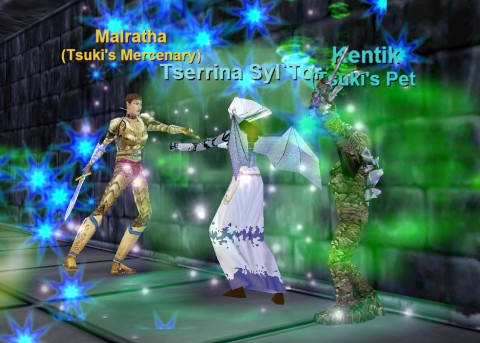
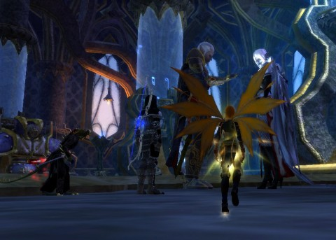
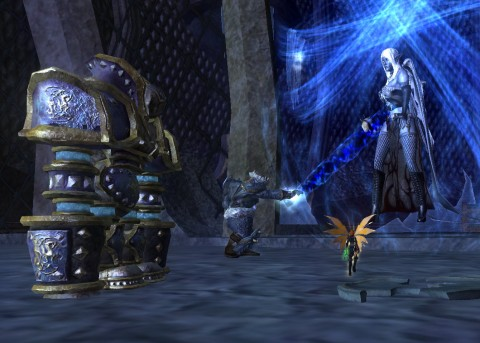

Back to: [West Karana](/posts/westkarana.md) > [2013](/posts/2013/westkarana.md) > [May](./westkarana.md)
# EQ2: The Sad Fate of Tserrina Syl'Tor

*Posted by Tipa on 2013-05-25 11:19:48*

[caption id="attachment\_10925" align="aligncenter" width="480"] This isn't how it went....[/caption]

We had a bunch of people hanging out in the Lunar Wolves guild hall last night. We've been threatening to, someday, form a group and go DO something for months now, but with everyone on their own real life schedules and our vastly differing levels of gear and skill, we just never seem to be on the same page at the same time.

But the desire was there, and soon enough we found ourselves at the bottom of the Tower of Frozen Shadow in the Great Divide. We were going to take on the Vampire Queen herself, Tserrina Syl'Tor. I was on my mage, and... wait... no... just had an EverQuest flashback. I used to camp Tserrina with my mage again and again, trying to get her robe. Even though Tsuki has a Plane of Fire robe, I've just always wanted to wear Tserrina's.

And it's more a flash-forward than a flashback, since I logged in to EverQuest this morning to take her on. Having not played an EQ1 mage for five years or more, it was a learning experience. There were deaths. Some of them, mine. 

She didn't drop the robe. But, we were talking about EverQuest II.

[caption id="attachment\_10926" align="aligncenter" width="480"] An Accursed Wedding[/caption]

With most everyone possessing several capable alts, it took awhile before we found a combo that worked for everyone. I volunteered to heal the instance with my inquisitor. Ejay was barding, Treadmill tanked with his pally, Weej was on his swashbuckler, Malforia on his necro, and Hamal being stabby with his assassin. 

We didn't really expect the tower to be any real danger, but it was worth the trip to finish some quests, get some more gnomeskin for our wardrobes, and just have some fun.

The wedding was wonderfully done. Oh, wait. Backing up.

At some point during the lower floors, Tread, the tank, succumbed to exhaustion and went to bed. Nobody else wanted to play tank, so I offered to switch to Scatter, my crap geared berserker, and we would use a mercenary for healing. Healing is pretty easy when you're in a good group, but tanking -- for a good group -- is incredibly challenging.

Nonetheless, this isn't the hardest zone in the world, and we worked up to the wedding without too much trouble. Now, the wedding back in the original ToFS was just a wedding being endlessly replayed by the hapless wedding party and guests for centuries for the amusement of their vampire masters.

The story is a little different in the EverQuest 2 version. In this one, the undead wedding is interrupted by the vampire queen Tserrina Syl'Tor who is continually angered by this wedding while her love goes unrequited. Her love, Mayong Mistmoore, soon shows up to banish Tserrina once more to the top of the tower.

[caption id="attachment\_10927" align="aligncenter" width="480"] Saved by the Dain[/caption]

After the wedding were a couple floors of topsy-turvy where we fought vampire nobility and collected mirror shards. We placed them in a particular way at the very top of the tower, where they opened the portal to Tserrina's lair. She is a two group fight, and this is usually where tower runs end.

Not this night. With a crap geared tank and an NPC healer, we decided to give it a shot. The merc died midway through our run. Scatter has a lot of self-heals and death saves, so I could hold Tserrina and her advisor at bay while Malforia rezzed the dead. The end of the fight, though, has a fully-healed, invulnerable Tserrina and there was nothing we could do but to wipe and try again.

Someone took a cheat peek at the wiki for the fight. Turned out we were doing everything pretty much as it should happen, except that the missing Dain, whom Tserrina has imprisoned in her tower with her for some reason (probably explained through the Coldain Ring quest) would take care of the vampire queen if we'd just bring her close to him at the correct time.

We replayed the scenario, except without so many deaths. I figured out when annoying adds were going to pop and managed to gather those before the dying started. The healer merc stayed alive, and when the advisor was about to aggro again, we dragged him to the Dain and killed the advisor at the dwarf king's feet. A furious and fully-healed Tserrina swooped in to finish us off, but was instead trapped by the Dain's power.

All that was left was to loot and gate back to the guild hall... and have a little chat with the mender.

There's so much older content in the game that is just every bit as much fun as the day it was released; we've seen that in our Emerald Halls run and last night's Frozen Shadow adventures. When you're with friends, almost anything is fun.

## Comments!

**Longasc** writes: Weddings are always great fun. Looking forward to the weddings in Game of Thrones. :)

---

