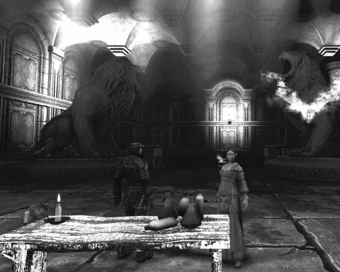
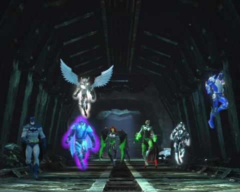
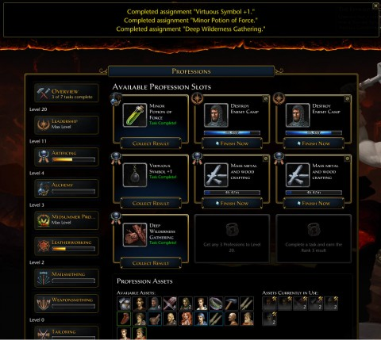

Back to: [West Karana](/posts/westkarana.md) > [2013](/posts/2013/westkarana.md) > [September](./westkarana.md)
# OMG, R U STILL AROUND?

*Posted by Tipa on 2013-09-10 23:28:48*

[caption id="attachment\_10981" align="aligncenter" width="480"] Trapped in a world without color[/caption]

I don't actually talk, or type, like that texty speak. I don't know what came over me.

Well, I kinda know. There was a bunch of bloggish commentary a few months back on the kind of random ranting bloggers do. You know, bloggers don't have any deeper insight than anyone else on anything, by and large, but we do have our blogs. It makes us feel more important, gives us a louder voice. But everyone shouts on the internet. It gets tiring. I realized that I really don't have anything to say about the current state of MMOs. I've stopped trying to follow the crowd to every new game; Sim City 5 cured me of that. Wow, way to buy into the hype, right?

I'm trying not to be caught up in the EverQuest Next hype. It's such a blank slate at this point that people feel free to read anything into the various teases. People in the public chat channels in EverQuest 2 speak with absolute certainty about things that contradict what some other certain person believes. As far me, I haven't seen any evidence of any gameplay, some thread through the game that keeps people logging in. I fear it's just going to take the usual sandbox route of being PvP focused -- "the players are the content!". In which case, they fail, because almost nobody plays the various EverQuests because they are astoundingly awesome PvP platforms. SOE may feel that PlanetSide 2's success has given them a good feel on how to make a successful PvP MMO, but -- EverQuest is not PlanetSide 2.

See, ranting again. It's an easy trap.

I still game, every night. My favorite nights, though, are when I game with friends. With Team Spode on Sundays, and with Kasul in Neverwinter on Mondays. I hope against hope for a regular group in EverQuest 2, but I don't think that's going to happen. The guild was going really well, lots of people were logging in and leveling and ready to go, but some key people left for a raid guild and that had a devastating effect. Maybe it's partly because of summer. But irregardless, I've been looking for a new obsession for awhile.

Not Candy Crush Saga. What is it about Match 3 games, anyway? I haven't found even one that I can play more than once. There's this huge, endless genre of games where you win by letting your mind wander as your fingers do some kind of complicated meditation that sends ever more flashing lights and loud sounds straight through your optic and auditory nerves into your brain. The resulting trance-like state must bring people close to some sort of nirvana.

Wikipedia says of nirvana ([the religious concept](http://en.wikipedia.org/wiki/Nirvana), not the band):

> The word literally means "blown out" (as in a candle) and refers, in the Buddhist context, to the imperturbable stillness of mind after the fires of desire, aversion, and delusion have been finally extinguished.

That... is what I assume playing Candy Crush Saga is like, for adherents. A stillness of mind without the cares of the physical realm. The MMOs I play are a step removed from the pure stuff. I have never understood how calling a game "addicting" would be a positive selling point. Maybe CCS is the pathway to enlightenment. A prayer wheel for the 21st century. Children, trained on CCS, will be able to fall into a trance state instantly, shuffling colors around in their mind, every match sending jolts of endorphins deep into their cortex. 

Indie developer Dave Toulouse challenged people on Google+ to try his Match 3 game, [Bret Airborne](http://www.machine22.com/bretairborne/), which (he thought) would appeal even to people who insisted they hated Match 3 games. Steampunk! Airships! Mad science! I bought it, played it as long as I could, haven't touched it since. The developer wanted feedback, but I was so depressed by my failure that I just stayed mum and moved on.

I just can't enjoy life.

[caption id="attachment\_10982" align="aligncenter" width="480"] Raiding in DCUO[/caption]

I mentioned awhile back that we were going to give raiding a shot in DC Universe Online -- strictly random raid stuff. We -- meaning only me, at this point, I guess. I need so many Marks of Triumph for gear (several thousand per piece, about a hundred per Tier 3 group mission at a time) that it will take me months and months to get even one piece at our current rate. Everyone else has managed to earn enough marks and farm enough exobits that they are playing at a much higher level. Me, those solo missions take me hours to do with lots of dying and aren't any sort of fun at all. So I stopped doing them. I have this idea that I would stop playing a game where I wasn't having a good time.

I also have this weird hangup about joining random groups. I'm paranoid that people will call me out for being a crappy player. This is because people regularly call me out for being a crappy player. We were working through a raid a couple weeks back and someone said they should start a vote to boot the crappy controller. Me, being the only controller in the raid, agreed, and said we should boot her right away. Nervous laughter -- wondering, maybe, if I understood they were talking about me. The vote was taken, I was kicked. I spent the rest of the night flying around cities alone, listening for the hum of exobits and wondering why I just didn't log off and delete the game. The other guys successfully completed the raid.

Last Sunday, we raided again. I chose the "damage" role that every class can choose so that I wouldn't be tapped to be a controller. Though I intended to play that role anyway. Entering as "damage" would just ensure there being a real controller along as well. Instead of trying to use crowd control powers, though, I just fed mana continuously the entire raid. Nobody tried to kick me, and we eventually succeeded. 200 Marks. Only about three thousand more to go for my first piece of Tier 3 gear.

[caption id="attachment\_10983" align="aligncenter" width="480"] Neverwinter Gateway[/caption]

I really enjoy my Neverwinter nights. Kasul and I alternate between doing Foundries one week and blasting through all the quests in a zone the next. Monday we explored The Chasm, a deep canyon full og toxic spell energy that warps the people and creatures within with the Spellplague. The zone's story ties neatly in to one of the first quest arcs you encounter in the game, a knight's desperate love for his spellplagued wife. There are twists and turns, and their story ends here.

Outside of game nights, we try not to gain too much experience (though the pig herding minigame in the Midsummer Festival zone is now my new addiction. I can't enjoy Match 3 games, but pig herding.... SOOOOO-WEEEEE.) Kasul and I are both inveterate \_crafters\_, though. Cryptic offers their entire crafting and auction house interfaces via their Neverwinter Gateway. So crafting can continue outside the game; it's always as close as my phone. As of the most recent update, the one that brought Weaponsmithing into the game, I've been making our weapons, while Kasul handles the armor for both our characters.

Naturally, with Neverwinter being a free-to-play game, the best results come only as a result of spending a significant amount of in-game currency in order to buy the exponentially expensive tools to get even a chance at a good result.I've spent all my in-game cash and a significant amount of real world money to get part of the way; Kasul has worked harder and gotten even better tools, some of which he's lent me as I try to make the weapons that will bring us to max level.

Not sure what happens at max level. The looking for group channel only seems to want people with astounding gear who can demonstrate a deep knowledge of every end game zone. This is almost always my cue to find another game. We're in a dead guild and won't be able to meet the requirements for groups or for experience with zones we've never seen.

We're talking about restarting, but I was hoping for some new classes to make the trip up more interesting. Neverwinter is all about ratcheting up the grind (literally) exponentially. Every step up is four times the difficulty of the one before, or requires four times as many resources. It takes sixteen tier 1 crafter hirelings to make one tier 3 crafter hireling, at a minimum time of (16 + 4 + 1) x 18 hours. 376 hours total? Minimum? You can speed this up with cash, of course. It takes 4 to the 7th power tier 1 enchantments to make even one of the tier 8 enchantments required in each piece of gear at end game. And here, Cryptic has given the "fuse" ability that takes four enchantments of one tier and produces one enchantment of the next tier, a chance of failure that increases to near certain failure as you move further up. Unless you spend cash.

I fear we're nearing the F2P cliff with Neverwinter. People are always saying that for MMOs, the game really begins at max level. But that just means it isn't the game that kept us logging in for all the levels before max level.

Cryptic's thought -- the thought of all F2P game companies -- is to hook them, then make them pay to continue. I get that, these games need to make money in order to stay running. I've spent quite a lot of real money in Neverwinter. They've gotten paid. But this exponential grind thing -- that's just paying for punishment. If I had a living guild or some more friends who wanted to group and play -- but that's not a thing that will happen. The GOGOGO mentality is alive and well in Neverwinter, and there's the gear checks and the aversion to new people and everything that drove me away from WoW.

So whenever I hit one of these F2P pitfalls in Neverwinter or some other game, I wonder how SOE is planning to punish me with EverQuest Next. They're going to start setting the hook with EverQuest Next Landmarks this winter, where players can create content for SOE to put into the main EQ Next. It sounds like we'll be charged to use this player-created content in the live game.

Just kinda worries me when I start hearing details about the monetization when I've heard nothing about how this game plans on being a game.

Plus, they seem to be setting the game in an alternate past, giving them no connection to the lore or locations from the current games, stomping on the number one request from current EverQuest and EverQuest 2 players. Bring back the world of EverQuest that we love, but with the latest technology.

Not gonna happen.

All they have to do, the only thing left for them to do, is announce a PvP focus for the game, to completely separate themselves from anything EQ players wanted from the game... er, sandbox.

## Comments!

**[bhagpuss](http://bhagpuss.blogspot.co.uk/)** writes: As you say, there's really so little hard information about EQN that anyone can project onto it anything they like. I do think perhaps you might be projecting "bad" things in a way just as unfounded by any actual evidence as all the people projecting "good" things.

Have they actually stated that they're "setting the game in an alternate past, giving them no connection to the lore or locations from the current games"? If there's some PR or an interview to that effect I'd like to read it if you have a link. They have said it's set in the past, because there was the whole example of the big event that leads to the founding of Halas and I think something similar might have been mentioned about Qeynos too. 

True, that does mean we won't arrive in a world with all the familiar names up and ready to go, but it's not the same as a complete separation from the lore. I'd think it would be pretty exciting and attractive to long-time EQ players to find themselves in on the founding of some of these landmarks (to coin a phrase). I'm certainly willing to give it the benefit of the doubt, at least.

As for PvP I would be absolutely astounded, shocked even, if EQN turns out to have any non-consensual PvP at all. At the very most I'd expect a specific continent set aside for it and really even that would surprise me. I imagine it will be ruleset servers in the way SOE have always done PvP in Everquest, with duelling and probably some form of instanced PvP on PvE servers. 

From the promotional material I've seen, the "sandbox" element is more about making EQ into a cross between Minecraft and Second Life than it references Planetside. I know they're using the same engine but I wouldn't draw any conclusions form that about what it will be used for. Personally I'm probably even less interested in a Minecraft/SL hybrid than I would be if they DID go full PvP but presumably there will still be some form of character-based MMO under there somewhere so I'll just play that and forego running my own business.

As for other options, have you considered FFXIV? It reminds all three people in my linkshell a lot of Vanguard, particularly the crafting and it's incredibly good to look at. It's nothing you haven't seen before but it's something you have enjoyed elsewhere done well and wrapped up in an extremely attractive package. 

Also EQ2 will probably see an uptick of player activity when the new expansion appears in November. That might open up group opportunities there.

DCUO does sound like an utter nightmare though - I've been reading your posts about the end-game progression with increasing disbelief. Not surprised you've hit a wall there.

---

**[Tipa](https://chasingdings.com)** writes: I mostly base what I know of the game on the fiction they released. It was set in the past, detailed what sounded like the ejection of elves from Tunaria, but the gods and mortals mentioned or implied had little to do with the current lore.

Am I projecting negative things? Yeah, probably. But I've been playing a bunch of F2P games and have grown wary of monetization. From what we know of EQN, it sounds very similar to Guild Wars 2 in a lot of ways -- solo focus, jack of all trades characters. Nothing sounds EverQuesty about the game to me at all, thus far.

---

**[Wilhelm Arcturus](http://tagn.wordpress.com/)** writes: I am a little weary of "indie" being used as a get out of jail free card for games that are mostly fair to middling on a good day.

On the F2P front, about which I have been all angsty for ages now, I will say that at least Neverwinter hasn't made me feel like I am missing something from day one by not spending money. Our group hasn't gone very far with it admittedly, and the game is still pretty new and hasn't had to start stirring the pot to get people to pay yet. But compared to how games like SWTOR, EQ2, or LOTRO hit you up and lock things down from the moment you show up, Neverwinter is very pleasant. 

Of course, Neverwinter doesn't have a subscription plan, so their model isn't "pretend to be free(ish) and then make the game annoying until the player goes back to the $15 a month."

And then there is EQN.

What to say that hasn't already been left unsaid at this point?

I was wondering if maybe, just maybe, SOE hired somebody new in marketing and they might use the information void left over from SOE Live to build momentum by revealing information slowly over time.

But no. So far the big engagement with players seems to be over whether female dwarves should have beards and if the fae should be a playable race in the new game. I am not expecting miracles, but they seem to be taking their domination of the news cycle for a short moment and squandering it away. Reminds me of The Agency.

---

**[Tipa](https://chasingdings.com)** writes: "What to say that hasn’t already been left unsaid at this point?"

I want to steal that :) It perfectly, and wittily, describes the state of things that we know about EQN, which is nearly nothing. NPCs that will pick up and move based on player actions, which means nothing more than that enterprising players will figure out how to pen mobs up for uber xp (or whatever the EQN analog to xp is) in AE groups.

I WANT to love EQN. But I can't love smoke and mirrors. They have to lift the curtain a bit, let us know what kind of game they're giving us.

And, The Agency? That STILL hurts. Wonder what went wrong there. Someone should write that story.

---

**[Everquest Next is People | Toldain Talks](http://toldaintalks.com/everquest-next-is-people/)** writes: [...] is feeling very, very skeptical about Everquest [...]

---

**[Warhammer Online to Shut Down in December | The Ancient Gaming Noob](http://tagn.wordpress.com/2013/09/19/warhammer-online-to-shut-down-in-december/)** writes: [...] an impact, for better or worse, that we still feel to this day.  Old timers skeptical about the hot new thing that was just announced?  Maybe they remember how that WAR hype paid off.  It was an event that [...]

---

