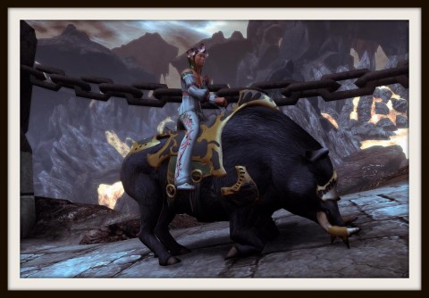
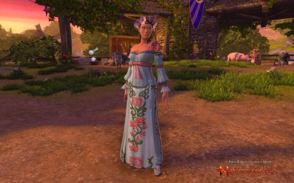
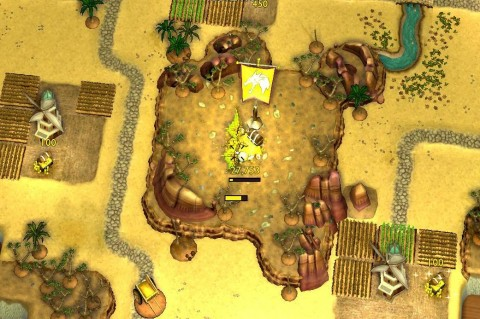

Back to: [West Karana](/posts/westkarana.md) > [2013](/posts/2013/westkarana.md) > [September](./westkarana.md)
# Top 5 Reasons why Neverwinter is the Best MMO That Can Exist, or, How To Twerk in World of Warcraft

*Posted by Tipa on 2013-09-12 00:32:46*

[caption id="attachment\_10986" align="aligncenter" width="480"] Boared Stiff.[/caption]

When I found out "Top (some number) (some thing)" articles were called "listicles" (for List Articles), my life was changed. I'd always had these feelings I couldn't explain, where I'd think of some provocative list of things and then put any old things in as the list, because getting people to click on the link and come to the article -- the LISTICLE -- would be mission accomplished. Article could be blank.

"How To" articles, though -- have listicles beat. You can be just as provocative with the title as you would be with a listicle, but you only have to write about one thing (be sure your AdWords bill is paid up!) In fact, as a corollary of Internet Rule 34, I just needed to Google Twerking in World of Warcraft to find this gem over at [One Crazy Paladin](http://onecrazypaladin.wordpress.com/2013/08/26/miley-cyrus-twerking-in-world-of-warcraft/):

[caption width="480" align="alignnone"] More than you wanted to see.[/caption]

I love this game. Let's try for... Three Wolf Moon in Guild Wars 2? [DONE](http://www.shockfront.net/forum/m/5314351/viewthread/7251323-three-wolf-moon/forum_id/1721783). I SWEAR to you that I didn't know there was a Lunar Wolf spell in Guild Wars 2 that did the Three Wolf Moon before I searched for it.

So that brings up probably the most popular kind of link bait in blogs: Writing an article about someone else's blog post. Bam. Original author gets new eyeballs, and you get some credit for pointing it out.

Don't make me look for Gangnam Style in, say, EverQuest.

[caption id="attachment\_10988" align="aligncenter" width="480"] Pig Herding[/caption]

But now I'm totally serious. Neverwinter is the best MMO that CAN EVER EXIST, and I think you'll agree when you find all your pig herding dreams are coming true for you in glorious F2P 3D.

See, the Midsummer Festival allows adventurers, for a short time, to visit a farming community on the outskirts of Neverwinter, which is having a festival that is being ruined by trolls in the barbecue, kobolds in the flower gardens, and pigs in the corn. Pigs and chickens. But for the purpose of this article, pigs.

Pigs are nasty little animals. They escape from their pens and go running through the corn. They're a pain to catch, so the inattentive farmer who keeps them has decided to let adventurers do the herding. The stubborn creatures refuse to move, or go dashing off the wrong way, or seem to ignore the big honking horse you're sitting on (horse really is necessary for pig herding), but after awhile you get the rhythm. You and the pigs come to an understanding. They're heading to the pen like they meant to go there on their own.

It's incredibly relaxing and fun. After crafting, it might be my favorite Neverwinter activity. And no pig is harmed, is the best thing.

And that's my top five reasons why Neverwinter is the best MMO that can ever be.

[caption id="attachment\_10989" align="aligncenter" width="480"] 2,600 petals later...[/caption]

The reason for my Midsummer obsession is a simple blouse, the Sunite Garb. There's three bits to the festival outfit; the pants, the headdress, and the garb (the blouse). The first two can be crafted with the special Midsummer Crafting, but the only way to get the blouse is to earn 2,600 petals and buy it from the petal store. You get around 300 petals for doing all the events and quests at least once each day. Helps if you can herd pigs like a Pokemon Master. Since I wanted the outfit for Nina and the petals are (mostly) no trade, I had to do the quests on Nina, breaking the leveling compact Kasul and I have to stay in sync. (You can pick twelve flower blossoms (also no trade) and with them purchase a Flower Garden Reward (tradeable) which can be opened by someone else for fifteen petals). You can follow someone killing kobolds and ninja all their flowers while they are still fighting. I know this because people kept doing it to me.

Anyway, outfit done, pig mount obtained, I'm done herding pigs and picking corn for lazy farmers. Hated every minute of it. Half elves get no respect.

[caption id="attachment\_10990" align="aligncenter" width="480"] For the HOARD![/caption]

I don't need to herd pigs, because I can be a dragon frying knights and ransoming princesses in HOARD. This little actioner came out last year, and I meant to try it out when it first came out, but for whatever reason did not. Now that EverQuest 2 has stopped taking up so much of my time, I'm branching out.

In HOARD, you play a dragon vying with other dragons (both AI and player controlled) to gather the most loot by the aforementioned depredations of the local nobility, razing fields, terrorizing towns and villages, and strategically igniting rolling dynamite carts where they will cause the most collateral damage. Against you are town-defending archers, tower-defending wizards, castle-defending knights, soon to be crisp thieves, and the other dragons, who don't know that they are really just gathering gold so that you can take it away later.

I choose to play in the relaxing "TREASURE" mode, where I have no dragony opposition, just me and a world that lives in fear of my shadow.

It's as restful as pig herding, and that's no lie.

